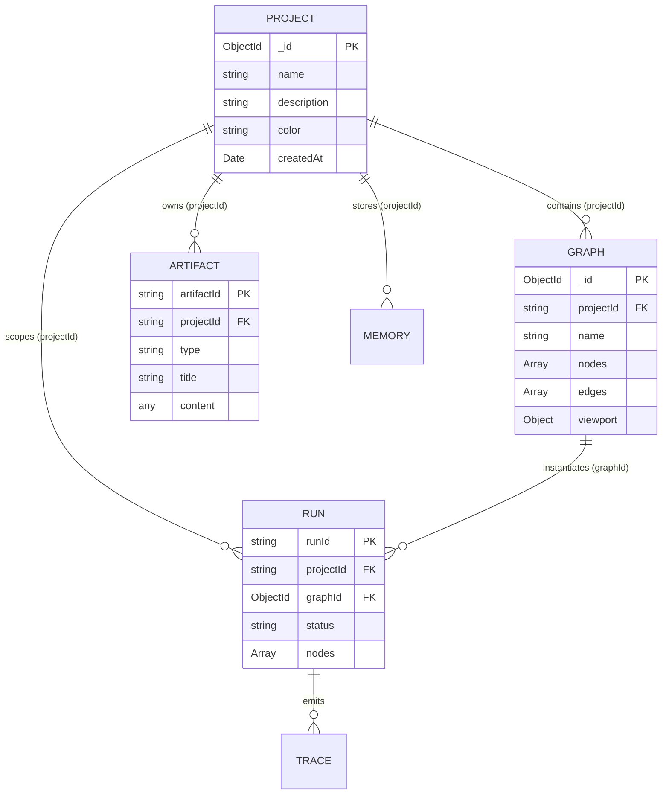

# Project & Flow Creation Guide: Architecture, API Endpoints & Database Structure

This guide provides comprehensive documentation on the **Project** and **Flow (Graph)** layers in the Flow Builder platform. It outlines the data model, database schema relationships, REST API endpoints, and step-by-step instructions for creating and managing projects and flows.

---

## Table of Contents
1. [Architectural Overview](#1-architectural-overview)
2. [Database Schema & Architecture](#2-database-schema--architecture)
   - [Project Schema (`projects`)](#project-schema-projects)
   - [Graph Schema (`graphs`)](#graph-schema-graphs)
   - [Associated & Scoped Schemas](#associated--scoped-schemas)
   - [Entity-Relationship Diagram](#entity-relationship-diagram)
3. [REST API Endpoints](#3-rest-api-endpoints)
   - [Projects API (`/api/projects`)](#projects-api-apiprojects)
   - [Graphs API (`/api/graphs`)](#graphs-api-apigraphs)
4. [Step-by-Step Walkthrough](#4-step-by-step-walkthrough)
   - [Step 1: Create a New Project](#step-1-create-a-new-project)
   - [Step 2: Create a Flow Under the Project](#step-2-create-a-flow-under-the-project)
   - [Step 3: Query & Filter Flows by Project](#step-3-query--filter-flows-by-project)
   - [Step 4: Execute the Flow](#step-4-execute-the-flow)
5. [Frontend UI Workflow](#5-frontend-ui-workflow)
6. [Data Migration & Scoping Rules](#6-data-migration--scoping-rules)

---

## 1. Architectural Overview

Flow Builder organizes all workflows into a two-tier hierarchy:

```
┌───────────────────────────────────────────────────────────┐
│                       PROJECT                             │
│  (Workspace, Tenancy, Scoped Artifacts, Scoped Runs)      │
└─────────────────────────────┬─────────────────────────────┘
                              │ 1 : N
                              ▼
┌───────────────────────────────────────────────────────────┐
│                     FLOW / GRAPH                          │
│  (Nodes, Edges, Viewport, Triggers, Execution Steps)      │
└─────────────────────────────┬─────────────────────────────┘
                              │ 1 : N
                              ▼
┌───────────────────────────────────────────────────────────┐
│                    EXECUTION RUN                          │
│  (State Checkpoints, Node Records, Output Payloads)       │
└───────────────────────────────────────────────────────────┘
```

- **Project**: Represents a discrete business initiative, application, or organizational domain (e.g., *"Customer Support AI"*, *"Document Intelligence"*). All flows, execution runs, artifacts, and memories are scoped to a `projectId`.
- **Flow (Graph)**: A directed graph consisting of blocks (`trigger`, `agent`, `browser`, `router`, etc.) interconnected via edges. Every flow is strictly owned by one parent project via `projectId: string`.
- **Run**: An execution instance of a flow. When a flow executes, the resulting run record inherits the flow's `projectId`.

---

## 2. Database Schema & Architecture

Flow Builder uses MongoDB with Mongoose schemas. Every entity (except global settings and LLM model definitions) is partitioned by `projectId: string`.

### Project Schema (`projects`)
Defined in `backend/src/projects/schemas/project.schema.ts`:

```typescript
@Schema({ timestamps: true })
export class Project {
  @Prop({ required: true, trim: true })
  name: string;

  @Prop({ trim: true, default: '' })
  description?: string;

  @Prop({ default: '#4f46e5' })
  color?: string; // UI hex badge accent

  @Prop({ type: Object, default: {} })
  metadata?: Record<string, any>;
}
```

| Field | Type | Required | Description |
| :--- | :--- | :--- | :--- |
| `_id` | `ObjectId` | Auto | Unique project identifier |
| `name` | `string` | **Yes** | Human-readable name of the project |
| `description` | `string` | No | Optional description or scope notes |
| `color` | `string` | No | Hex color code used for UI badges (default: `#4f46e5`) |
| `metadata` | `Record<string, any>` | No | Arbitrary JSON metadata (e.g., `isDefault: true`) |
| `createdAt` | `Date` | Auto | Timestamp of creation |
| `updatedAt` | `Date` | Auto | Timestamp of last modification |

---

### Graph Schema (`graphs`)
Defined in `backend/src/graphs/schemas/graph.schema.ts`:

```typescript
@Schema({ timestamps: true })
export class Graph {
  @Prop({ required: true, index: true })
  projectId: string; // Foreign key referencing Project._id

  @Prop({ required: true, trim: true })
  name: string;

  @Prop({ type: Array, default: [] })
  nodes: Record<string, any>[];

  @Prop({ type: Array, default: [] })
  edges: Record<string, any>[];

  @Prop({
    type: Object,
    default: { x: 0, y: 0, zoom: 1 },
  })
  viewport: {
    x: number;
    y: number;
    zoom: number;
  };

  @Prop({ type: Object, default: {} })
  metadata: Record<string, any>;
}
```

| Field | Type | Required | Description |
| :--- | :--- | :--- | :--- |
| `_id` | `ObjectId` | Auto | Unique graph/flow identifier |
| `projectId` | `string` | **Yes** | ID of the owning project (`Project._id.toString()`) |
| `name` | `string` | **Yes** | Name of the flow board |
| `nodes` | `Array<Node>` | No | React Flow canvas nodes with configuration payload |
| `edges` | `Array<Edge>` | No | Directional connections between node sockets |
| `viewport` | `Object` | No | `{ x: number, y: number, zoom: number }` |
| `metadata` | `Object` | No | Tags, variables, or custom configuration |

---

### Associated & Scoped Schemas

All secondary runtime entities are bound to the project layer:

1. **`Run` (`runs`)**:
   - `projectId: string` (indexed)
   - `graphId: ObjectId` (references `Graph`)
   - Tracks live execution state, node steps, and output payloads.
2. **`Artifact` (`artifacts`)**:
   - `projectId: string` (indexed)
   - Documents, PRDs, tech specs, or code patches generated during runs.
3. **`Memory` (`memories`)**:
   - `projectId: string` (indexed)
   - Compound index: `{ projectId: 1, namespace: 1, key: 1 }`.
4. **`Trace` (`traces`)**:
   - `projectId: string` (indexed)
   - Relational links between runs, artifacts, and events.
5. **`VectorRecord` (`vectorrecords`)**:
   - `projectId: string` (indexed)
   - Scoped semantic chunks and embeddings.

*Exempt Schemas (Global / Not Scoped by Project)*:
- `settings` (`Setting`)
- `embedding_models` (`EmbeddingModel`)
- `llmmodels` (`LLMModel`)

---

### Entity-Relationship Diagram



---

## 3. REST API Endpoints

The API is served at `http://localhost:6300/api` (or via `process.env.NEXT_PUBLIC_API_URL`).

### Projects API (`/api/projects`)

#### 1. List Projects
Returns all projects along with aggregated flow counts and run counts.

- **Method**: `GET /api/projects`
- **Response**: `200 OK`
```json
[
  {
    "_id": "6a99bcfc636072bb867a0bad",
    "name": "Default Project",
    "description": "Default workspace for flows and agents",
    "color": "#4f46e5",
    "metadata": { "isDefault": true },
    "graphCount": 3,
    "runCount": 30,
    "createdAt": "2026-09-03T18:31:24.551Z",
    "updatedAt": "2026-09-03T18:31:24.551Z"
  }
]
```

#### 2. Get Single Project
- **Method**: `GET /api/projects/:id`
- **Response**: `200 OK`

#### 3. Create Project
- **Method**: `POST /api/projects`
- **Request Body**:
```json
{
  "name": "Finance Automations",
  "description": "Invoice processing and ERP synchronization",
  "color": "#059669",
  "metadata": {}
}
```
- **Response**: `201 Created`
```json
{
  "_id": "6a99ce124b893fa11234abcd",
  "name": "Finance Automations",
  "description": "Invoice processing and ERP synchronization",
  "color": "#059669",
  "metadata": {},
  "createdAt": "2026-09-03T19:00:00.000Z",
  "updatedAt": "2026-09-03T19:00:00.000Z"
}
```

#### 4. Update Project
- **Method**: `PUT /api/projects/:id`
- **Request Body**: Partial update (`name`, `description`, `color`, `metadata`).
- **Response**: `200 OK`

#### 5. Delete Project
Deletes the project and cascade-deletes all associated graphs and runs. (Safeguard: Deletion of the final remaining project is blocked).
- **Method**: `DELETE /api/projects/:id`
- **Response**: `200 OK`
```json
{
  "success": true,
  "message": "Project \"Finance Automations\" and associated flows deleted"
}
```

---

### Graphs API (`/api/graphs`)

#### 1. List Graphs (Filtered by Project)
- **Method**: `GET /api/graphs?projectId=:projectId`
- **Query Parameters**:
  - `projectId` *(optional)*: When supplied, only returns flows belonging to this project.
- **Response**: `200 OK`
```json
[
  {
    "id": "6a987cb228694ca5e03a7d89",
    "name": "Classification Flow",
    "projectId": "6a99bcfc636072bb867a0bad",
    "nodeCount": 9,
    "edgeCount": 6,
    "createdAt": "2026-09-02T19:44:50.109Z",
    "updatedAt": "2026-09-03T18:31:30.772Z",
    "metadata": {}
  }
]
```

#### 2. Create Graph Under Project
- **Method**: `POST /api/graphs`
- **Request Body**:
```json
{
  "name": "Invoice Triage Flow",
  "projectId": "6a99ce124b893fa11234abcd",
  "nodes": [],
  "edges": [],
  "viewport": { "x": 0, "y": 0, "zoom": 1 }
}
```
- **Response**: `201 Created`

#### 3. Update Graph
- **Method**: `PUT /api/graphs/:id`
- **Request Body**: `name`, `nodes`, `edges`, `viewport`, `metadata`, `projectId`.
- **Response**: `200 OK`

#### 4. Execute Graph
Creates and starts an execution run inheriting the flow's `projectId`.
- **Method**: `POST /api/graphs/:id/run`
- **Request Body**: `{ "input": { "invoiceNumber": "INV-1092" } }`
- **Response**: `200 OK` (returns `RunResult` containing `runId`, `projectId`, etc.)

---

## 4. Step-by-Step Walkthrough

### Step 1: Create a New Project

Using `curl`:
```bash
curl -X POST http://localhost:6300/api/projects \
  -H "Content-Type: application/json" \
  -d '{
    "name": "Customer Support AI",
    "description": "Multi-agent ticketing system",
    "color": "#2563eb"
  }'
```

Output:
```json
{
  "_id": "6a99f182c129487b3281aa01",
  "name": "Customer Support AI",
  "description": "Multi-agent ticketing system",
  "color": "#2563eb",
  "metadata": {},
  "createdAt": "2026-09-03T20:10:00.000Z",
  "updatedAt": "2026-09-03T20:10:00.000Z"
}
```

---

### Step 2: Create a Flow Under the Project

Use the `_id` returned from Step 1 as `projectId`:

```bash
curl -X POST http://localhost:6300/api/graphs \
  -H "Content-Type: application/json" \
  -d '{
    "name": "Ticket Classification Flow",
    "projectId": "6a99f182c129487b3281aa01",
    "nodes": [
      {
        "id": "trigger_1",
        "type": "custom",
        "position": { "x": 100, "y": 150 },
        "data": {
          "label": "Webhook Trigger",
          "toolType": "trigger",
          "inputs": {
            "triggerType": "webhook",
            "topic": "support.ticket.created"
          }
        }
      },
      {
        "id": "agent_1",
        "type": "custom",
        "position": { "x": 420, "y": 150 },
        "data": {
          "label": "Classifier Agent",
          "toolType": "agent",
          "inputs": {
            "systemPrompt": "Classify the ticket into billing, technical, or inquiry."
          }
        }
      }
    ],
    "edges": [
      {
        "id": "e_trigger_agent",
        "source": "trigger_1",
        "target": "agent_1"
      }
    ]
  }'
```

---

### Step 3: Query & Filter Flows by Project

Retrieve only flows that belong to the new project:

```bash
curl -s "http://localhost:6300/api/graphs?projectId=6a99f182c129487b3281aa01"
```

---

### Step 4: Execute the Flow

Execute the graph by ID:

```bash
curl -X POST "http://localhost:6300/api/graphs/YOUR_GRAPH_ID/run" \
  -H "Content-Type: application/json" \
  -d '{
    "input": {
      "ticketId": "TCK-8821",
      "text": "I was double charged on my subscription."
    }
  }'
```

The resulting run record will automatically be stored with `projectId: "6a99f182c129487b3281aa01"`.

---

## 5. Frontend UI Workflow

In the Flow Studio web interface:

1. **Header Project Selector**:
   - Located next to the **Flow Studio** brand badge in the top navigation bar.
   - Click to view all available projects, flow counts, and active indicators.
2. **Creating a Project in the UI**:
   - Click the Project Selector dropdown -> click **+ New Project**.
   - Enter a Name, Description, and select an accent color.
   - Click **Create Project**; the interface will automatically switch to the newly created project.
3. **Building Flows in the Project**:
   - Flows created while this project is active automatically bind to its `projectId`.
   - The **Save Modal** confirms and displays the target project.
4. **Loading Flows**:
   - Opening the **Load Modal** (`FolderOpen` button) displays flows scoped to the active project.
   - A project dropdown inside the modal allows switching projects on the fly or viewing all flows.
5. **Managing Projects**:
   - Click **Manage Projects** from the Project Selector to rename, change colors, review flow and run statistics, or delete projects.

---

## 6. Data Migration & Scoping Rules

- **Default Project Bootstrap**: On backend startup, `ProjectsService.onModuleInit()` ensures at least one project exists. If none is found, it automatically creates `"Default Project"`.
- **Orphan Adoption**: Any graph, run, or artifact missing a `projectId` is automatically updated and adopted into the Default Project.
- **Migration CLI Command**:
  To execute or verify migrations manually, run:
  ```bash
  cd backend
  npm run migrate
  ```
- **Validation**:
  - `CreateGraphDto` strictly validates `@IsNotEmpty() @IsString() projectId: string`.
  - Creating a graph without a valid `projectId` will return a `400 Bad Request`.
