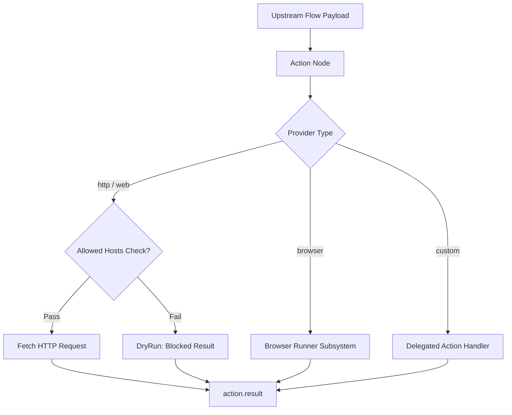

# Action Tool Documentation & Usage Guide

The **Action** node provides outbound interaction capabilities across your agentic workflows. It executes operations against external HTTP REST APIs, webhooks, headless browser automation runners, or custom third-party integrations with built-in host security allowlists.

---

## Table of Contents
1. [Overview & Architecture](#1-overview--architecture)
2. [Node Inputs & Configuration](#2-node-inputs--configuration)
3. [Providers & Execution Behavior](#3-providers--execution-behavior)
   - [HTTP / Web Provider](#http--web-provider)
   - [Browser Automation Provider](#browser-automation-provider)
   - [Generic / Delegated Provider](#generic--delegated-provider)
4. [Security & Allowed Hosts](#4-security--allowed-hosts)
5. [Outputs & Result Schema](#5-outputs--result-schema)
6. [Real-World Recipes & Examples](#6-real-world-recipes--examples)
7. [Best Practices & Troubleshooting](#7-best-practices--troubleshooting)

---

## 1. Overview & Architecture

The Action node acts as the primary external gateway for workflow side-effects and API communication:
- **Provider-Based Routing**: Delegates execution based on the configured `provider` (`http`, `browser`, or custom integration names).
- **Security Sandboxing**: Enforces hostname checking against `allowedHosts` to prevent unauthorized requests or SSRF vulnerabilities.
- **Unified Result Handling**: Returns standardized JSON output containing HTTP response bodies, status codes, headers, or browser execution results.



---

## 2. Node Inputs & Configuration

| Input Field | Type | Required | Default | Description |
| :--- | :--- | :--- | :--- | :--- |
| `provider` | `text` | Yes | `"http"` | Target provider: `"http"`, `"web"`, `"browser"`, or integration name. |
| `action` | `text` | Yes | `"request"` | Specific operation to execute (e.g. `"request"`, `"scrape"`, `"webhook"`). |
| `url` | `valueOrVariable` | Conditional | `null` | Target URL when `provider` is `"http"` or `"web"`. Supports variable interpolation. |
| `method` | `select` | No | `"GET"` | HTTP Method: `GET`, `POST`, `PUT`, `DELETE`. |
| `parameters` | `json` | No | `null` | Structured payload, query params, or custom arguments. |
| `actions` | `json` | No | `null` | Sequence of browser interaction steps (used when `provider` is `"browser"`). |
| `allowedHosts` | `json` | No | `null` | Array of permitted domain strings (e.g. `["api.github.com", "hooks.slack.com"]`). |

---

## 3. Providers & Execution Behavior

### HTTP / Web Provider
When `provider` is `"http"` or `"web"`:
1. Validates that `url` starts with `http://` or `https://`.
2. Extracts the hostname and checks it against `allowedHosts`.
3. Dispatches the HTTP request with configured `method`, `headers`, and `parameters` (serialized as the request body for POST/PUT).
4. Automatically parses the response body as JSON if possible, falling back to raw string.

```json
{
  "provider": "http",
  "action": "request",
  "url": "https://api.github.com/repos/owner/repo/issues",
  "method": "POST",
  "parameters": {
    "title": "Bug found during flow execution",
    "body": "Automated report from workflow run {{runId}}"
  },
  "allowedHosts": ["api.github.com"]
}
```

### Browser Automation Provider
When `provider` is `"browser"`:
- Delegates the action to the internal `BrowserRunnerService`.
- Executes element interactions, page navigations, clicks, or text extractions defined in the `actions` array.
- Emits screenshots, extracted DOM content, or execution summaries in the result.

### Generic / Delegated Provider
For third-party or custom providers (e.g. `"slack"`, `"salesforce"`, `"email"`), the node wraps the inputs into a delegated payload for downstream processors or external webhook relays.

---

## 4. Security & Allowed Hosts

To prevent Server-Side Request Forgery (SSRF) and ensure safe execution:
- Supply an explicit array of permitted hostnames in `allowedHosts`.
- If the target URL does not match any entry in `allowedHosts`, execution will not fail with an unhandled exception. Instead, it returns a safe blocked response:

```json
{
  "status": "completed",
  "result": {
    "provider": "http",
    "action": "request",
    "dryRun": true,
    "blocked": true,
    "reason": "Host is not in allowedHosts",
    "url": "https://untrusted-domain.internal/admin"
  }
}
```

---

## 5. Outputs & Result Schema

The Action node provides a single, unified output handle:

- **`result`** (`object`): Structured object containing the execution response.

### Successful HTTP Response Shape
```json
{
  "status": "completed",
  "result": {
    "provider": "http",
    "action": "request",
    "status": 200,
    "ok": true,
    "headers": {
      "content-type": "application/json; charset=utf-8"
    },
    "body": {
      "id": 1049281,
      "state": "open",
      "url": "https://api.github.com/repos/owner/repo/issues/42"
    }
  }
}
```

---

## 6. Real-World Recipes & Examples

### Recipe 1: Sending Webhook Notifications to Slack
Trigger an external alert when an upstream validation succeeds:

```json
{
  "provider": "http",
  "action": "webhook",
  "url": "https://hooks.slack.com/services/T00/B00/XXXXX",
  "method": "POST",
  "parameters": {
    "text": "Workflow completed successfully for artifact {{artifact.title}}"
  },
  "allowedHosts": ["hooks.slack.com"]
}
```

### Recipe 2: Calling Internal Microservice with Variable Interpolation
Fetch customer CRM record using dynamic customer ID:

```json
{
  "provider": "http",
  "action": "fetch-customer",
  "url": "https://crm.internal.corp/api/v1/users/{{trigger.input.userId}}",
  "method": "GET",
  "allowedHosts": ["crm.internal.corp"]
}
```

---

## 7. Best Practices & Troubleshooting

1. **Always Configure `allowedHosts`**: Protect against accidental requests to sensitive private network addresses (e.g. `localhost`, `169.254.169.254`).
2. **Check `ok` and `status` Downstream**: In downstream Condition nodes, evaluate `action_1.result.ok === true` to branch into success or fallback error handlers.
3. **Payload Formatting**: When passing variables to `parameters`, ensure upstream nodes emit valid JSON objects or use Mustache templating `{{nodes.node_1.result}}`.
