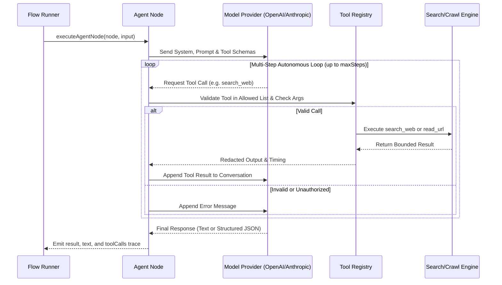

# Agent Tool Documentation & Usage Guide

The **Agent** node introduces Large Language Model (LLM) intelligence directly into your flow pipelines. It supports prompt engineering, variable interpolation, multi-modal file/media attachments (vision, audio, PDFs), temperature fine-tuning, and structured JSON output constrained by Zod schemas.

---

## Table of Contents
1. [Overview & Architecture](#1-overview--architecture)
2. [Node Inputs & Configuration](#2-node-inputs--configuration)
3. [Autonomous Tool-Using Agents](#3-autonomous-tool-using-agents)
   - [How the Autonomous Tool Loop Works](#how-the-autonomous-tool-loop-works)
   - [Registered Autonomous Tools & Signatures](#registered-autonomous-tools--signatures)
   - [Guardrails, Limits & Redaction](#guardrails-limits--redaction)
   - [Execution Traces & Inspection](#execution-traces--inspection)
4. [Supported Models & Providers](#4-supported-models--providers)
5. [Prompt Templating & Variable Interpolation](#5-prompt-templating--variable-interpolation)
6. [Multi-Modal Attachments (Vision, Audio, Docs)](#6-multi-modal-attachments-vision-audio-docs)
7. [Structured JSON Output & Zod Schemas](#7-structured-json-output--zod-schemas)
8. [Outputs & Referencing in Downstream Nodes](#8-outputs--referencing-in-downstream-nodes)
9. [Real-World Examples & Recipes](#9-real-world-examples--recipes)
   - [Recipe 1: Autonomous Web Research Agent with Sources](#recipe-1-autonomous-web-research-agent-with-sources)
   - [Recipe 2: Web Page Screenshot Visual QA Auditor](#recipe-2-web-page-screenshot-visual-qa-auditor)
   - [Recipe 3: Customer Inquiry Classification & Routing](#recipe-3-customer-inquiry-classification--routing)
10. [Troubleshooting & Best Practices](#10-troubleshooting--best-practices)

---

## 1. Overview & Architecture

When an Agent node executes during a flow run:
- **Model Resolution**: The node loads configured provider credentials, endpoint URLs, and default settings from the internal Models database (`/api/models`), supporting OpenAI, Anthropic, Ollama, and custom OpenAI-compatible endpoints.
- **Autonomous Tool Reasoning**: When tools are enabled, the Agent enters an autonomous reasoning loop, deciding when to search the web, read pages, inspect intermediate evidence, search again, and conclude with a synthesized answer.
- **Prompt Synthesis**: The `systemPrompt` and `userPrompt` templates are evaluated with runtime variables from upstream nodes (e.g. `{{browser_1.result.url}}`, `{{trigger.input.query}}`).
- **Multi-Modal Processing**: If media attachments are enabled, image screenshots, audio recordings, or PDF documents are encoded into base64 data URLs and attached directly into the multi-modal payload.
- **Output Validation & Extraction**: Depending on `outputFormat`, responses are returned as plain text or parsed into a strongly-typed JSON object conforming to your `outputType` Zod schema. All tool executions are captured in `toolCalls`.

---

## 2. Node Inputs & Configuration

| Input Field | Type | Required | Default | Description |
| :--- | :--- | :--- | :--- | :--- |
| `model` | `select` | Yes | `"gpt-4o"` | The LLM model to execute. Populated dynamically via `/api/models`. |
| `endpoint` | `text` | No | `null` | Base URL or full chat completions URL endpoint override. |
| `enableTools` | `checkbox` | No | `false` | Enable autonomous tool use loop (model can call approved tools). |
| `allowedTools` | `valueOrVariable` | Conditional | `["search_web", "read_url"]` | Array of authorized tools the agent may call autonomously. Multiselect chips or variable. |
| `maxSteps` | `number` | Conditional | `5` | Maximum number of tool execution steps before forcing a conclusion (1-20). Guardrail against infinite loops. |
| `customTemperature` | `checkbox` | No | `false` | Enable to override the model's default sampling temperature. |
| `temperature` | `number` | Conditional | `0.7` | Sampling temperature (0.0 = deterministic, 1.0 = creative). Visible only when `customTemperature` is `true`. |
| `reasoningEffort` | `select` | No | `"model_default"` | Reasoning effort: `"model_default"`, `"none"`, `"low"`, `"medium"`, `"high"`. |
| `reasoningFormat` | `select` | No | `"hidden"` | Formatting of reasoning tokens: `"hidden"`, `"parsed"`, `"raw"`. |
| `systemPrompt` | `textarea` | Yes | `"You are a helpful AI assistant..."` | High-level instructions defining role, persona, constraints, and instructions. |
| `userPrompt` | `textarea` | Yes | `""` | The prompt sent as the user turn. Supports mustache templates `{{nodeName.field}}`. |
| `enableAttachment` | `checkbox` | No | `false` | Enables attaching external media (images, audio, PDFs) to the prompt. |
| `attachment` | `valueOrVariable` | Conditional | `null` | Local file path, remote URL, or upstream node variable (e.g. `{{browser.screenshot}}`). |
| `attachmentType` | `select` | Conditional | `"auto"` | Media category: `"auto"`, `"image"`, `"audio"`, or `"document"`. |
| `outputFormat` | `radio` | Yes | `"text"` | Response formatting: `"text"` or `"json"`. |
| `outputType` | `code` (ts) | Conditional | `null` | Zod schema definition for JSON mode. Downstream nodes can autocomplete its properties. |

---

## 3. Autonomous Tool-Using Agents

When `enableTools` is checked, the Agent node operates as an autonomous agent that iteratively solves complex research and decision tasks:



### How the Autonomous Tool Loop Works
1. **Tool Registration**: The Agent retrieves schemas for only its configured `allowedTools` (e.g. `search_web`, `read_url`).
2. **Model Call with Tools**: The conversation and tool definitions are sent to the model provider (OpenAI `tools` or Anthropic `tools`).
3. **Tool Call Detection**: The runner inspects the model turn. If tool calls are requested, the runner pauses model generation.
4. **Validation & Authorization**: Tool names are checked against the node's allowlist. Unlisted tools are immediately rejected. Arguments are validated and sanitized.
5. **Bounded Execution**: The tool is executed via internal backend services. Results are trimmed (e.g. page text bounded to `maxContentLength`, search results capped) to avoid blowing up context windows.
6. **Trace Logging**: Start time, end time, duration, status, and redacted arguments/results are recorded in `toolCalls`.
7. **Iteration / Completion**: The tool output is appended to the message history, and the model continues reasoning until it outputs its final answer or `maxSteps` is reached.

### Registered Autonomous Tools & Signatures

#### 1. `search_web`
Searches the web in real-time via the Tavily Search integration:
- **Arguments**:
  - `query` (`string`, required): Search terms or research question.
  - `maxResults` (`number`, optional, default `5`, max `10`): Result count limit.
  - `searchDepth` (`"basic" | "advanced"`, optional): Search depth.
  - `topic` (`"general" | "news"`, optional): Filter category.
- **Output Shape**:
  ```json
  {
    "query": "LangGraph multi-agent architecture",
    "resultsCount": 3,
    "answer": "LangGraph provides stateful multi-actor workflows...",
    "results": [
      {
        "title": "LangGraph Documentation",
        "url": "https://langchain-ai.github.io/langgraph/",
        "content": "Overview of cyclic multi-agent graphs..."
      }
    ]
  }
  ```

#### 2. `read_url`
Fetches and cleans article/page content from a known web URL:
- **Arguments**:
  - `url` (`string`, required): The HTTP or HTTPS URL to read.
  - `mode` (`"read_article" | "fetch_and_clean"`, optional, default `"read_article"`): Content cleaning strategy.
  - `maxContentLength` (`number`, optional, default `8000`, max `20000`): Maximum characters returned.
- **Output Shape**:
  ```json
  {
    "url": "https://example.com/article",
    "title": "State of Autonomous AI 2026",
    "status": 200,
    "text": "# State of Autonomous AI 2026\n\nRecent advances show...",
    "linksCount": 4,
    "links": [
      { "text": "Benchmarks", "href": "https://example.com/benchmarks" }
    ]
  }
  ```

### Guardrails, Limits & Redaction
- **Allowlist Enforcement**: The agent cannot call any tool not listed in `allowedTools`.
- **Step Cap**: `maxSteps` (default: 5, range: 1–20) bounds total iterations, preventing runaway loops.
- **Timeout Protection**: The entire loop respects `timeoutMs` (default: 90,000ms).
- **Repeated Failure Circuit Breaker**: If 3 consecutive invalid calls occur, the loop terminates cleanly with the completed trace.
- **Secret Redaction**: API keys, bearer tokens, and credentials are automatically scrubbed via `redactSecrets` before saving to traces or returning to models.

### Execution Traces & Inspection
All tool calls are persisted in the run record under `nodeRecord.output.toolCalls` and rendered interactively in the **Execution Trace** tab of the Execution Studio, complete with status pills, durations in ms, and expandable argument/result inspectors.

---

---

## 4. Supported Models & Providers

The agent runtime natively handles multiple LLM providers:

### OpenAI & OpenAI-Compatible Endpoints
- **GPT-4o / GPT-4o Mini**: Full text, vision, and autonomous tool calling support via `tools` function schemas.
- **OpenRouter / Groq**: Autonomous tool calling supported on tool-compatible models (e.g. Llama 3.3, Qwen 2.5 72B).
- **o1 / o3 Reasoning Models**: Reasoning tokens supported. *(Note: Reasoning models like `o1-mini` do not support tool calling; the runner returns a clear explanatory error if configured with tools).*
- **Local Ollama / vLLM**: Works with tool calling when using OpenAI-compatible endpoints (`/v1/chat/completions`) with tool-capable models.

### Anthropic Claude
- **Claude 3.5 Sonnet / Claude 3 Opus / Haiku**: Formatted via Anthropic's Messages API (`/v1/messages`) with full support for autonomous multi-step tool calls (`tool_use` and `tool_result`).

---

## 5. Prompt Templating & Variable Interpolation

Both `systemPrompt` and `userPrompt` support dynamic variable substitution using `{{ ... }}` syntax:

```markdown
Analyze this scraped web content:
URL: {{nodes.browser_1.result.url}}
Document Title: {{nodes.browser_1.result.title}}
Extracted Text:
{{nodes.browser_1.result.actions[3].text}}
```

### Context Scopes:
- Upstream Node Outputs: `{{nodes.nodeName.outputProperty}}` or `{{nodeName.outputProperty}}`
- Flow Run Input: `{{input.propertyName}}` or `{{trigger.input.propertyName}}`
- In-memory Variables: `{{variables.myVar}}`

---

## 6. Multi-Modal Attachments (Vision, Audio, Docs)

When analyzing browser screenshots, diagrams, photos, or documents, enable **Attach File / Media**:

```json
{
  "enableAttachment": true,
  "attachment": "{{nodes.browser_1.result.actions[4].path}}",
  "attachmentType": "image"
}
```

### Supported Attachment Sources:
1. **Local File Paths**: Absolute paths on the runner disk (e.g., `/Users/.../files/screenshots/shot.png`). The runner automatically detects mime types (`image/png`, `image/jpeg`, `image/webp`, `audio/mp3`, `application/pdf`) and encodes the file into a base64 Data URL.
2. **Data URLs**: Direct `data:image/png;base64,...` strings.
3. **HTTP/HTTPS URLs**: Publicly accessible web image URLs.
4. **Structured Objects**: Objects containing a `.path` property returned by tools like the Browser screenshot action.

---

## 7. Structured JSON Output & Zod Schemas

To reliably pass structured data to downstream nodes (Condition, Transform, Script, or API calls), set `outputFormat` to `"json"` and define an `outputType` using Zod syntax:

```typescript
z.object({
  sentiment: z.enum(["positive", "neutral", "negative"]),
  summary: z.string(),
  keyPoints: z.array(z.string()),
  urgencyScore: z.number().min(1).max(10),
  actionRequired: z.boolean()
})
```

When JSON mode is active:
1. The backend automatically augments the system prompt with strict schema enforcement instructions.
2. The agent response is parsed and validated.
3. All defined properties (`sentiment`, `summary`, `keyPoints`, etc.) become selectable in downstream `VariablePicker` components across the flow.

---

## 8. Outputs & Referencing in Downstream Nodes

The Agent node emits the following outputs:

| Output Name | Type | Description |
| :--- | :--- | :--- |
| `done` | branch | Completion event for connecting the Agent to the next flow step. |
| `result` | `object` | Parsed JSON object conforming to `outputType` (or text string in text mode). |
| `text` | `string` | The complete raw string response generated by the model. |
| `reasoning` | `string` | Chain-of-thought or reasoning trace (if supported by model and enabled). |
| `toolCalls` | `array` | Sequential trace array of all autonomous tool calls executed by the agent. |

### Downstream Referencing Syntax:

```json
{{nodes.agent_1.text}}
{{nodes.agent_1.result.findings}}
{{nodes.agent_1.result.sources[0].url}}
{{nodes.agent_1.toolCalls[0].tool}}
{{nodes.agent_1.toolCalls[0].durationMs}}
```

---

## 9. Real-World Examples & Recipes

### Recipe 1: Autonomous Web Research Agent with Sources
This agent searches the live web, selects relevant articles, reads page text, and returns structured findings with full source citations:

```json
{
  "model": "gpt-4o",
  "enableTools": true,
  "allowedTools": ["search_web", "read_url"],
  "maxSteps": 5,
  "systemPrompt": "You are an autonomous research intelligence agent. When given a research question:\n1. Search the web for authoritative sources using `search_web`.\n2. Read key articles using `read_url` to inspect deep evidence.\n3. Re-search if necessary.\n4. Return your final findings strictly in the requested JSON schema with source URLs and confidence scores.",
  "userPrompt": "Research the latest architectural features of LangGraph 2026: {{trigger.input.topic}}",
  "outputFormat": "json",
  "outputType": "z.object({\n  topic: z.string(),\n  summary: z.string(),\n  keyFindings: z.array(z.string()),\n  sources: z.array(z.object({\n    title: z.string(),\n    url: z.string(),\n    relevance: z.string()\n  })),\n  confidenceScore: z.number().min(0).max(1)\n})"
}
```

### Recipe 2: Web Page Screenshot Visual QA Auditor
```json
{
  "model": "gpt-4o",
  "systemPrompt": "You are a senior UI/UX engineer and QA tester. Review the attached webpage screenshot and audit visual hierarchy, typography, broken layouts, and contrast.",
  "userPrompt": "Please review this screenshot from {{nodes.browser_1.result.url}}.",
  "enableAttachment": true,
  "attachment": "{{nodes.browser_1.result.actions[2].path}}",
  "attachmentType": "image",
  "outputFormat": "json",
  "outputType": "z.object({\n  hasBugs: z.boolean(),\n  issues: z.array(z.string()),\n  score: z.number()\n})"
}
```

### Recipe 3: Customer Inquiry Classification & Routing
```json
{
  "model": "gpt-4o-mini",
  "systemPrompt": "You are an automated support ticket triage assistant.",
  "userPrompt": "Customer message: {{trigger.input.customerMessage}}",
  "outputFormat": "json",
  "outputType": "z.object({\n  category: z.enum(['billing', 'technical', 'sales', 'general']),\n  priority: z.enum(['low', 'medium', 'high']),\n  suggestedResponse: z.string()\n})"
}
```

---

## 10. Troubleshooting & Best Practices

1. **Autonomous Tool Selection**: Keep `allowedTools` limited to the tools strictly needed for the task (`search_web` and `read_url`). Do not grant unneeded tools to specialized agents.
2. **Step Limits**: Set `maxSteps` reasonably (3 to 6 steps is ideal for research tasks). If an agent consistently hits `maxSteps` without concluding, refine the `systemPrompt` to instruct the agent to formulate answers after 1–2 searches.
3. **JSON Validation Failures**: If the model occasionally wraps responses in markdown code blocks (\`\`\`json ... \`\`\`), the backend automatically cleans and unescapes it, but using clear field names in your Zod schema ensures the model returns exact matches.
4. **Reasoning Models (Qwen / DeepSeek / o1)**: When using reasoning models, note that `o1-mini` and `o1-preview` do not support tool calling. Use `gpt-4o`, `gpt-4o-mini`, or `claude-3-5-sonnet` for autonomous tool execution.
5. **Context Window Protection**: The runner automatically truncates tool results (`maxContentLength` for `read_url` and snippet character limits for `search_web`) to ensure the agent's context window does not overflow.

## Research findings and source provenance

For evidence-based research, return `{ "findings": [...] }` using the shared contract in `backend/doc/research/provenance-and-review.md` and enable **Validate Research Findings**. A finding separates the claim, source-specific supporting evidence, qualifying or contradictory evidence, confidence, limitations, and question IDs. The Agent node fails with field-level validation errors when the result lacks valid provenance. Schema validation checks structure and traceability; it does not verify factual truth.

The autonomous `search_web` tool returns bounded results with query, title, original and resolved URLs, excerpt, score, publication date or `null`, access timestamp, provider, and retrieval status. `read_url` returns the requested and resolved URLs, extracted text, title or `null`, access timestamp, retrieval method, and HTTP status. Missing titles and publication dates are not invented. A source without a real title cannot be used as a valid finding source until the researcher obtains that metadata. Tool output remains bounded and secret-redacted.
