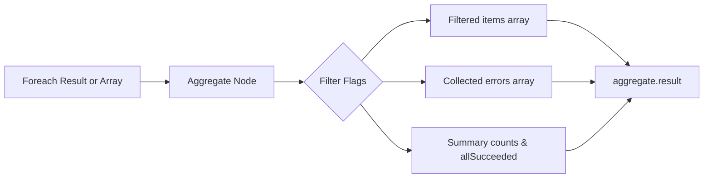

# Aggregate Tool Documentation & Usage Guide

The **Aggregate** node normalizes, filters, and summarizes the output of `Foreach` or any other collection-producing block. It is a pure in-memory transformation block.

---

## Table of Contents
1. [Overview & Architecture](#1-overview--architecture)
2. [Node Inputs & Configuration](#2-node-inputs--configuration)
3. [Filtering & Processing Rules](#3-filtering--processing-rules)
4. [Outputs & Schema](#4-outputs--schema)
5. [Best Practices](#5-best-practices)

---

## 1. Overview & Architecture

When collection iterations produce heterogeneous outcomes (some completed, some failed), downstream nodes often need a consolidated summary and clean lists.



Key features:
- **Zero Database Access**: Pure in-memory transformation.
- **Flexible Input Acceptance**: Accepts either a raw array of items or a `Foreach` result object.
- **Success/Failure Filtering**: Optionally includes or excludes items based on success status.
- **Order Preservation**: Preserves the original sequence of items.

---

## 2. Node Inputs & Configuration

| Input Field | Type | Required | Default | Description |
| :--- | :--- | :--- | :--- | :--- |
| `items` | `valueOrVariable` | Yes | - | Array of item results or a Foreach result containing an `items` array. |
| `includeSuccessful` | `checkbox` | No | `true` | Include successful items in the output items array. |
| `includeFailed` | `checkbox` | No | `true` | Include failed items in the output items array. |

---

## 3. Filtering & Processing Rules

- **Success Detection**: An item is considered failed if `item.status === "failed"` or it contains an `error` property. Otherwise, it is considered successful.
- **Filter Flags**:
  - `includeSuccessful: false`: Strips all successful items from `result.items`, leaving only failed items.
  - `includeFailed: false`: Strips all failed items from `result.items`, leaving only successful items.
- **Summary Metrics**:
  - `count`: Number of items returned in `items` (post-filtering).
  - `successCount`: Total count of successful items in the input.
  - `failureCount`: Total count of failed items in the input.
  - `allSucceeded`: `true` if `failureCount === 0`.
  - `truncated`: Propagates `truncated` from the input Foreach result, or `false`.

---

## 4. Outputs & Schema

The node outputs a single `result` object:

```json
{
  "status": "completed",
  "result": {
    "items": [
      {
        "index": 0,
        "item": { "id": "task-1" },
        "status": "completed",
        "result": { "processed": true }
      }
    ],
    "errors": [],
    "count": 1,
    "successCount": 1,
    "failureCount": 0,
    "allSucceeded": true,
    "truncated": false
  }
}
```

If the input is invalid (e.g., not an array or object containing `items`), `status: "failed"` is returned with a descriptive validation error.

---

## 5. Best Practices

1. **Chain After Foreach**: Connect directly downstream of `Foreach` to inspect batch execution results.
2. **Branch on Success**: Use `aggregate.result.allSucceeded` in a downstream **Condition** node to decide between proceeding to production or alerting on failures.
