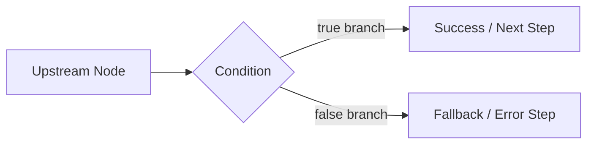

# Condition Tool Documentation & Usage Guide

The **Condition** node provides decision branching and flow control within your agentic workflows. It evaluates comparisons or custom JavaScript expressions and routes graph execution exclusively along either the **True** or **False** branch handles.

---

## Table of Contents
1. [Overview & Architecture](#1-overview--architecture)
2. [Node Inputs & Configuration](#2-node-inputs--configuration)
3. [Condition Modes](#3-condition-modes)
   - [Comparison Mode](#comparison-mode)
   - [Custom Expression Mode](#custom-expression-mode)
4. [Supported Comparison Operators](#4-supported-comparison-operators)
5. [Branch Routing & Flow Control](#5-branch-routing--flow-control)
6. [Outputs & Execution Results](#6-outputs--execution-results)
7. [Real-World Examples & Recipes](#7-real-world-examples--recipes)
8. [Troubleshooting & Best Practices](#8-troubleshooting--best-practices)

---

## 1. Overview & Architecture

When a Condition node executes:
- **Evaluation**: Resolves the upstream variables or evaluates a custom JavaScript expression.
- **Branch Selection**: Determines whether the evaluation results in `true` or `false`.
- **Selective Edge Traversal**: The Flow Graph Runner inspects outgoing edges from the node and queues *only* the downstream nodes connected to the matching branch handle (`true` or `false`). Nodes connected to the opposite handle are skipped entirely.



---

## 2. Node Inputs & Configuration

| Input Field | Type | Required | Default | Description |
| :--- | :--- | :--- | :--- | :--- |
| `mode` | `radio` | Yes | `"comparison"` | Evaluation mode: `"comparison"` or `"expression"`. |
| `leftValue` | `variable` | Conditional | `null` | The left-hand variable operand to evaluate. Required in comparison mode. |
| `operator` | `select` | Conditional | `"equals"` | The comparison operator. Required in comparison mode. |
| `rightValue` | `valueOrVariable` | Conditional | `null` | The right-hand operand (literal string/number or variable). |
| `expression` | `code` (js) | Conditional | `""` | Custom JavaScript snippet returning boolean. Required in expression mode. |

---

## 3. Condition Modes

### Comparison Mode
Ideal for straightforward, declarative checks without writing code.

```json
{
  "mode": "comparison",
  "leftValue": "agent_1.result.actionRequired",
  "operator": "equals",
  "rightValue": true
}
```

### Custom Expression Mode
Ideal for complex, multi-field evaluations, nested arrays, regex matching, or compound logical checks (`&&`, `||`).

```json
{
  "mode": "expression",
  "expression": "return input.score >= 80 && input.status === 'verified';"
}
```

#### Available Scope in Expression Mode:
- **`input`**: The primary input passed into the node.
- **`context`**: The global workflow context dictionary.
- **Named upstream variables**: All upstream nodes are accessible directly as variables by their node name (e.g. `agent_1`, `browser_1`, `jsonparser_1`).

---

## 4. Supported Comparison Operators

| Operator | Internal Value | Behavior | Example |
| :--- | :--- | :--- | :--- |
| **Equals** | `equals` | Strict equality or string match (`left === right` or `String(left) === String(right)`) | `left: "active"`, `right: "active"` → `true` |
| **Not Equals** | `notEquals` | Negated equality (`left !== right`) | `left: 404`, `right: 200` → `true` |
| **Contains** | `contains` | Array inclusion check (`left.includes(right)`) or substring search | `left: ["admin", "editor"]`, `right: "admin"` → `true` |
| **Greater Than** | `greaterThan` | Numeric comparison (`Number(left) > Number(right)`) | `left: 85`, `right: 50` → `true` |
| **Less Than** | `lessThan` | Numeric comparison (`Number(left) < Number(right)`) | `left: 3`, `right: 10` → `true` |
| **Is Empty** | `isEmpty` | Checks if `null`, `undefined`, `""`, or empty array `[]` | `left: []` → `true` |

---

## 5. Branch Routing & Flow Control

The Condition node renders two distinct output handles on the canvas:
- **`true`** (Green socket): Followed when condition evaluates to true.
- **`false`** (Red / Orange socket): Followed when condition evaluates to false.

Connecting downstream nodes to both handles creates an `if/else` fork in your graph.

---

## 6. Outputs & Execution Results

When execution finishes, the Condition node stores the following result in state:

```json
{
  "result": true,
  "conditionMet": true
}
```

Downstream nodes can reference the boolean decision:
- `{{nodes.condition_1.result}}`
- `{{nodes.condition_1.conditionMet}}`

---

## 7. Real-World Examples & Recipes

### Recipe 1: Quality Score Gate (Comparison)
*Check if an Agent QA evaluation score exceeds 75.*

```json
{
  "mode": "comparison",
  "leftValue": "agent_audit.result.score",
  "operator": "greaterThan",
  "rightValue": 75
}
```

### Recipe 2: Bug Detection Router (Comparison)
*Route to an alert channel if an agent flagged bugs in a visual audit.*

```json
{
  "mode": "comparison",
  "leftValue": "agent_visual_qa.result.hasBugs",
  "operator": "equals",
  "rightValue": true
}
```

### Recipe 3: Multi-Criteria Gate (Expression)
*Verify that an order has at least 1 item, total exceeds $100, and customer is not blacklisted.*

```json
{
  "mode": "expression",
  "expression": "const items = input?.items || [];\nconst total = input?.orderTotal || 0;\nconst isFlagged = Boolean(input?.customer?.isFlagged);\n\nreturn items.length > 0 && total >= 100 && !isFlagged;"
}
```

### Recipe 4: Loop Counter Termination (Comparison)
*Terminate a looping workflow once a counter reaches 5.*

```json
{
  "mode": "comparison",
  "leftValue": "variables.retryCount",
  "operator": "lessThan",
  "rightValue": 5
}
```

---

## 8. Troubleshooting & Best Practices

1. **Unwrapping Single-Key Objects**: If your left value comes from a node that wrapped its output in `{ value: 42 }`, the condition runner automatically unwraps single-property objects so comparisons work seamlessly.
2. **Numeric Comparisons**: When comparing numbers, ensure literal `rightValue` inputs are valid numbers or numeric strings.
3. **Empty Branch Warning**: If no edges are connected to the selected branch handle, execution of that path stops gracefully without failing the overall run.
