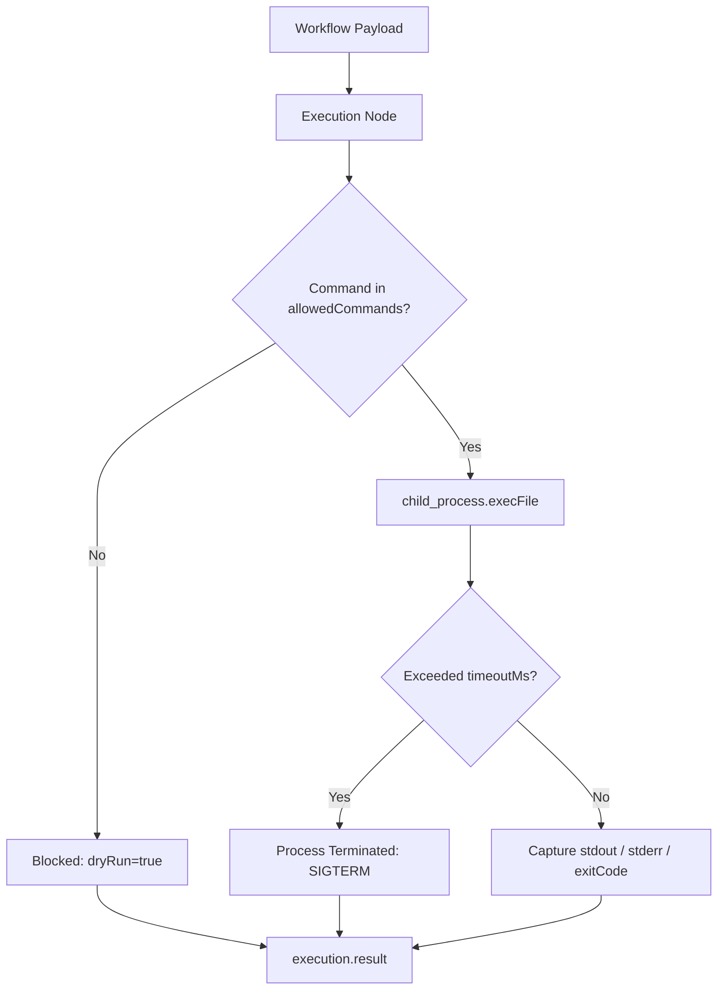

# Execution Tool Documentation & Usage Guide

The **Execution** node runs local command-line binaries, scripts, and system executables in a sandboxed child process under an explicit security allowlist. It allows workflows to perform Git operations, trigger build pipelines, run Python or Bash data processors, and interact directly with host tools.

---

## Table of Contents
1. [Overview & Architecture](#1-overview--architecture)
2. [Node Inputs & Configuration](#2-node-inputs--configuration)
3. [Security & Strict Command Allowlisting](#3-security--strict-command-allowlisting)
4. [Process Execution & Resource Safety](#4-process-execution--resource-safety)
5. [Outputs & Schema](#5-outputs--schema)
6. [Real-World Recipes](#6-real-world-recipes)
7. [Troubleshooting & Best Practices](#7-troubleshooting--best-practices)

---

## 1. Overview & Architecture

The Execution node invokes system executables using Node.js `child_process.execFile`:
- **Direct Binary Invocation**: Arguments are passed as an array directly to the executable, avoiding shell string interpolation attacks (`sh -c`).
- **Strict Allowlisting**: Every invocation must pass the `allowedCommands` verification filter.
- **Resource Constraints**: Default 2-minute execution timeout (`timeoutMs: 120000`) and a 5MB standard buffer limit prevent runaway processes.



---

## 2. Node Inputs & Configuration

| Input Field | Type | Required | Default | Description |
| :--- | :--- | :--- | :--- | :--- |
| `command` | `text` | Yes | `null` | Binary executable to run (e.g. `"git"`, `"python3"`, `"docker"`). |
| `args` | `json` | No | `[]` | Array of string arguments passed to the command. |
| `cwd` | `text` | No | `process.cwd()` | Working directory where the command will execute. |
| `allowedCommands` | `json` | Yes | `[]` | Mandatory array of permitted command names (e.g. `["git", "python3"]`). |
| `timeoutMs` | `number` | No | `120000` | Process execution timeout in milliseconds (default: 2 minutes). |

---

## 3. Security & Strict Command Allowlisting

To prevent arbitrary command injection, the runtime strictly validates the `command` against `allowedCommands`.

If a command is **not** present in `allowedCommands`, execution is blocked safely without throwing an unhandled server crash:

```json
{
  "status": "completed",
  "result": {
    "command": "rm",
    "args": ["-rf", "/"],
    "dryRun": true,
    "blocked": true,
    "reason": "Command is not in allowedCommands"
  }
}
```

---

## 4. Process Execution & Resource Safety

- **No Shell Expansion**: Arguments in `args` are passed directly without shell expansion, neutralizing shell injection vulnerabilities (`&&`, `;`, `|`).
- **Buffer Safety**: Captures up to 5,000,000 bytes (5MB) of combined standard output.
- **Exit Code Isolation**: Failures return `status: "failed"` with captured `stdout`, `stderr`, and numeric `exitCode` instead of halting the entire graph runner unceremoniously.

---

## 5. Outputs & Schema

The node returns a single `result` object:

### Successful Execution Output
```json
{
  "status": "completed",
  "result": {
    "command": "git",
    "args": ["status", "--porcelain"],
    "exitCode": 0,
    "stdout": " M backend/src/tools/doc/execution.md\n",
    "stderr": ""
  }
}
```

### Failed Command Output
```json
{
  "status": "failed",
  "error": "Command failed: python3 script.py",
  "result": {
    "command": "python3",
    "args": ["script.py"],
    "exitCode": 1,
    "stdout": "",
    "stderr": "FileNotFoundError: [Errno 2] No such file or directory: 'data.csv'\n"
  }
}
```

---

## 6. Real-World Recipes

### Recipe 1: Git Branch Verification
Check repository status before building an artifact:

```json
{
  "command": "git",
  "args": ["rev-parse", "--abbrev-ref", "HEAD"],
  "allowedCommands": ["git"],
  "timeoutMs": 5000
}
```

### Recipe 2: Running a Python Data Processing Script
Execute a localized data cleanup script:

```json
{
  "command": "python3",
  "args": ["scripts/clean_data.py", "--input", "{{trigger.input.filePath}}"],
  "allowedCommands": ["python3"],
  "cwd": ".",
  "timeoutMs": 60000
}
```

---

## 7. Troubleshooting & Best Practices

1. **Explicit Arguments**: Always split command arguments into an array (e.g. `["status", "-s"]`), not a single combined string `["status -s"]`.
2. **Handle Exit Codes in Conditions**: Connect a **Condition** node downstream to check `execution_1.result.exitCode === 0` to branch between success and error handling.
3. **Specify Working Directory (`cwd`)**: Use absolute paths or relative workspace paths to ensure scripts resolve their dependencies and source files accurately.
