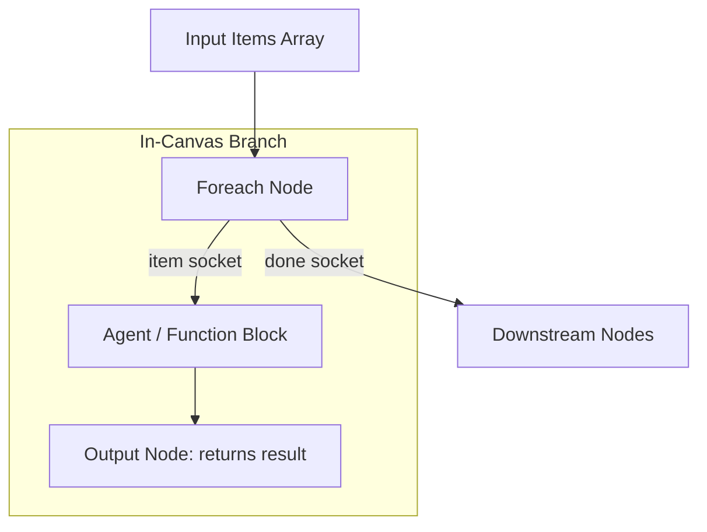

# Foreach Tool Documentation & Usage Guide

The **Foreach** node iterates over an input collection either by executing **in-canvas nodes directly on the board** or by calling a **saved child graph**. It supports synchronous (wait & aggregate) or asynchronous (non-blocking) dispatch, controlled concurrency (1 to 10), truncation guardrails, and error-handling behaviors.

---

## Table of Contents
1. [Overview & Architecture](#1-overview--architecture)
2. [Node Inputs & Configuration](#2-node-inputs--configuration)
3. [Execution Modes](#3-execution-modes)
   - [In-Canvas Mode (Output Node & Branch Handles)](#in-canvas-mode)
   - [Child Subgraph Mode](#child-subgraph-mode)
4. [Synchronous vs. Asynchronous Dispatch](#4-synchronous-vs-asynchronous-dispatch)
5. [Outputs & Schema](#5-outputs--schema)
6. [Best Practices](#6-best-practices)

---

## 1. Overview & Architecture

`Foreach` supports two architectural models:

1. **In-Canvas Branch (No Subgraph needed)**:
   - Connect the **`item`** handle to a sequence of nodes on the same canvas (e.g. `Agent` &rarr; `Output`).
   - Terminate the iteration branch with an **`Output`** block to define each item's return payload.
   - Connect the **`done`** handle to subsequent workflow steps.
2. **Child Subgraph**:
   - Executes a saved graph identified by `graphId`.



---

## 2. Node Inputs & Configuration

| Input Field | Type | Required | Default | Description |
| :--- | :--- | :--- | :--- | :--- |
| `mode` | `select` | No | `"canvas"` | `"canvas"` (in-graph branch) or `"subgraph"` (saved child graph). |
| `executionType` | `select` | No | `"sync"` | `"sync"` (waits for all items & aggregates) or `"async"` (non-blocking dispatch). |
| `items` | `valueOrVariable` | Yes | - | Array of items or an object containing an `items` array. |
| `graphId` | `select` | Only in `subgraph` mode | - | The saved child graph to execute for each item (`/api/graphs`). |
| `baseInput` | `valueOrVariable` | No | `{}` | Optional base payload merged into every item invocation. |
| `maxIterations` | `number` | No | `25` | Maximum number of items to process (range: 1–100). |
| `concurrency` | `number` | No | `1` | Number of concurrent runs (range: 1–10). |
| `stopOnError` | `checkbox` | No | `false` | If `true`, stops launching new runs after the first failure. |
| `outputMode` | `select` | No | `"result"` | Subgraph output mode: `"result"` or `"state"`. |
| `outputType` | `code` | No | - | TypeScript interface describing child result for autocomplete. |

---

---

## 3. Execution Modes

### In-Canvas Mode (`mode: "canvas"`)
Executes an iteration pipeline built directly on the current flow board:
- **`item` handle** (orange): Connects to the worker sequence (e.g. `Agent`, `Script`, `Transform`).
- **`Output` block**: Connect to the end of the iteration sequence. Its configured value becomes the return payload for each item.
- **`done` handle** (green): Triggers when all iterations have finished, continuing downstream execution.
- **Available Variables**: Downstream and loop-branch nodes can reference:
  - `{{foreach_1.item}}`: The current item being processed.
  - `{{foreach_1.index}}`: Zero-based index of the item.
  - `{{foreach_1.total}}`: Total number of items in the input collection.
  - `{{foreach_1.result.items}}`: Full aggregated array of item results.

### Child Subgraph Mode (`mode: "subgraph"`)
Delegates each item execution to an external saved flow board identified by `graphId`:
- For each item, the child graph Trigger receives:
  ```json
  {
    ...baseInput,
    "item": "<currentItem>",
    "index": 0,
    "total": 3
  }
  ```
- Lineage: The child run inherits `parentRunId`.

---

## 4. Synchronous vs. Asynchronous Dispatch

| Mode | Configuration | Behavior | Best Used For |
| :--- | :--- | :--- | :--- |
| **Synchronous** | `executionType: "sync"` | Waits for all items to complete across the bounded worker pool (1–10). Collects all results and populates `foreach.result.items` before activating `done`. | Downstream processing that depends on the collected outputs (e.g. summarization, DB bulk write). |
| **Asynchronous** | `executionType: "async"` | Dispatches worker executions in the background (fire-and-forget). Immediately activates `done` without blocking the parent run. | Background batch indexing, webhook fan-out, or notifications where caller response shouldn't wait. |

---

## 5. Execution Rules & Concurrency

- **Sequential Execution**: Default `concurrency: 1` processes items one at a time.
- **Bounded Parallelism**: Concurrency values up to 10 are supported using a bounded worker pool.
- **Truncation Guardrail**: If `items.length > maxIterations`, processing stops at `maxIterations` and `truncated: true` is reported.
- **Stop on Error**:
  - `stopOnError: false`: Processing continues for all items; overall status is `"partial"` if any item failed.
  - `stopOnError: true`: No new items are initiated after a failure; overall status is `"failed"`.
- **Child Human Gate**: A saved child graph may pause for human input when Foreach is synchronous and concurrency is 1. The parent pauses and resumes the same child run; completed items are reused through idempotency keys.

---

## 6. Outputs & Schema

The node outputs a single `result` object:

```json
{
  "status": "completed",
  "count": 2,
  "processed": 2,
  "truncated": false,
  "items": [
    {
      "index": 0,
      "item": { "id": "doc-1" },
      "status": "completed",
      "result": { "summary": "Financial report Q3" }
    },
    {
      "index": 1,
      "item": { "id": "doc-2" },
      "status": "completed",
      "result": { "summary": "Product release notes" }
    }
  ],
  "errors": []
}
```

Status meanings:
- `completed`: All processed items succeeded.
- `partial`: At least one item failed, but processing continued (`stopOnError: false`).
- `failed`: Execution stopped due to error with `stopOnError: true` or configuration validation error.

---

## 7. Best Practices

1. **Use In-Canvas Mode for Quick Sub-Pipelines**: Build your loop directly on the board with `Agent` &rarr; `Output` without needing to switch boards.
2. **Always Terminate In-Canvas Loops with `Output`**: The `Output` node cleanly defines the boundary and return payload for each item.
3. **Combine with Aggregate**: Connect the `done` output of `Foreach` to an **Aggregate** node to filter, count, and summarize item results.
4. **Choose Sync vs. Async Deliberately**: Use `sync` when downstream nodes need the data; use `async` when downstream steps should proceed immediately.

## Human gates in foreach

A human gate or Telegram question may run inside a saved child graph when Foreach is synchronous with concurrency 1. The parent run pauses, exposes the child waiting form, and resumes the child before continuing the remaining items. Asynchronous or concurrent child graphs with human gates are rejected during validation. In-canvas item branches still do not support waiting gates; place their gate after Foreach.
