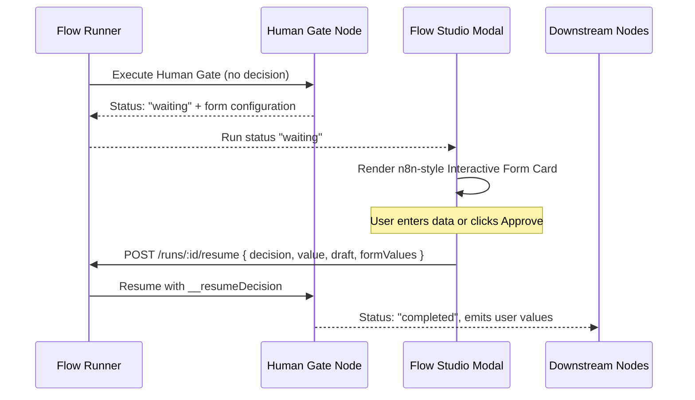
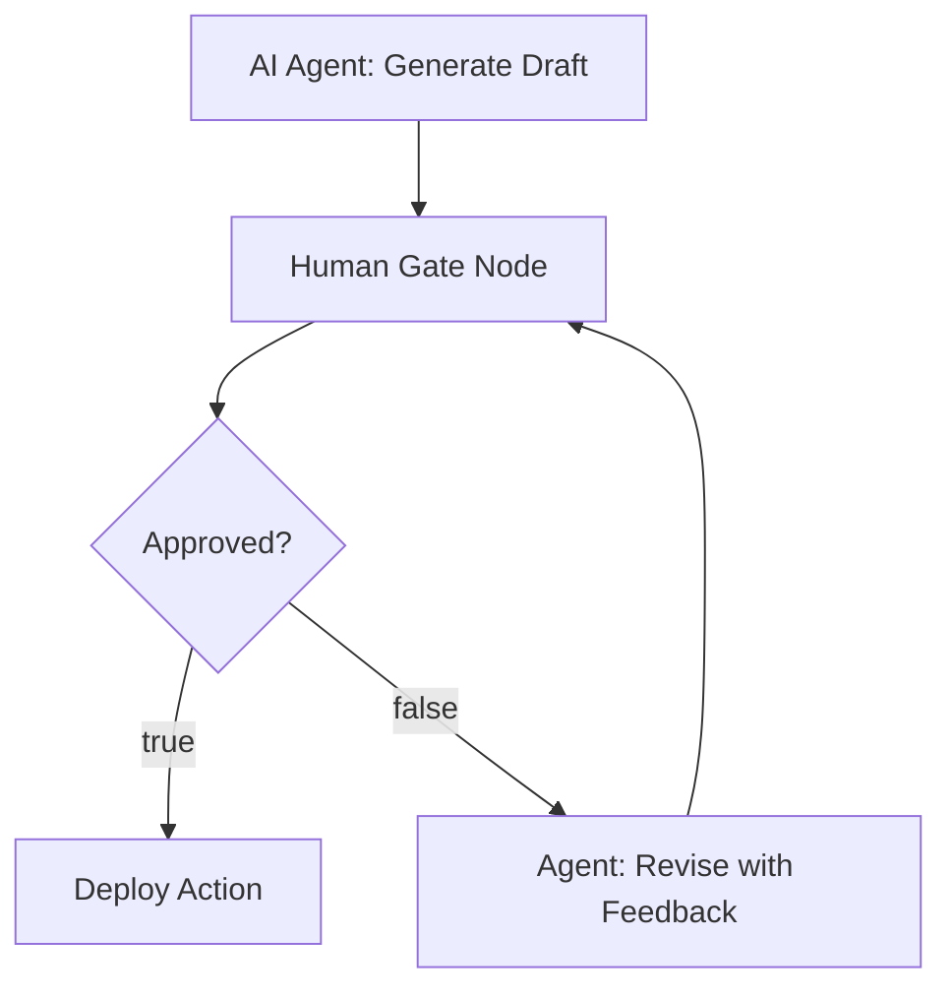

# Human Gate Tool Documentation & Usage Guide (n8n Style)

The **Human Gate** node pauses workflow execution for human-in-the-loop (HITL) review, verification, input collection, or approval. Inspired by **n8n's Form & Approval Trigger / Wait nodes**, it dynamically renders interactive UI components (Approve/Reject buttons, single-line text, multi-line textareas, dropdown selects, radio pills, or multi-field forms) directly in Flow Studio.

When the workflow encounters a Human Gate without a pre-existing decision, execution transitions to the `waiting` state, generating a secure token and waiting payload. Once an operator reviews the draft and submits their inputs in the dialog or via API, the workflow seamlessly resumes with the user's decision, values, and edits.

---

## Table of Contents
1. [Overview & n8n Architecture](#1-overview--n8n-architecture)
2. [Node Inputs & Configuration](#2-node-inputs--configuration)
   - [Supported Input Types](#supported-input-types)
   - [Full Parameter Reference](#full-parameter-reference)
3. [Execution Lifecycle & Resumption](#3-execution-lifecycle--resumption)
   - [Stage 1: Flow Pause & Form Presentation](#stage-1-flow-pause--form-presentation)
   - [Stage 2: User Submission & Graph Resumption](#stage-2-user-submission--graph-resumption)
4. [Outputs & Schema](#4-outputs--schema)
5. [Downstream Routing with Conditions](#5-downstream-routing-with-conditions)
6. [Real-World Recipes](#6-real-world-recipes)
   - [Recipe 1: Binary Approval with Draft Refinement](#recipe-1-binary-approval-with-draft-refinement)
   - [Recipe 2: Dynamic Select Dropdown](#recipe-2-dynamic-select-dropdown)
   - [Recipe 3: Comprehensive Multi-Field Form](#recipe-3-comprehensive-multi-field-form)
7. [Best Practices](#7-best-practices)

---

## 1. Overview & n8n Architecture

Autonomous AI agents and automated flows often reach moments where human discretion is required—whether approving an email blast, picking an action mode, or providing required parameters that cannot be inferred.

Like **n8n's Human-in-the-loop nodes**, this implementation provides:
- **Zero-Block Asynchronous Pause**: The execution engine saves the run state as `waiting` and frees server resources.
- **Dynamic Component Rendering**: Flow Studio detects the `waiting` node and dynamically renders the appropriate UI form component.
- **Upstream Draft Inspection & In-place Editing**: Reviewers can inspect upstream output (e.g. LLM draft) and optionally modify it directly before proceeding.
- **Stateful Resumption**: Calling `POST /runs/:runId/resume` continues execution from the exact waiting node, passing user inputs downstream.



---

## 2. Node Inputs & Configuration

### Supported Input Types

| Input Type (`inputType`) | Rendered Component | Best Used For |
| :--- | :--- | :--- |
| `approval` *(default)* | Prominent **Approve** (green) & **Reject** (red) buttons + feedback textarea | Publishing, deployment gates, compliance sign-offs |
| `textarea` | Multi-line expandable text editor | Custom review feedback, critique, long-form human instructions |
| `text` | Single-line text input | Names, API keys, URLs, brief titles |
| `select` | Dropdown picker populated from `options` | Fixed choice selection (e.g. "Staging", "Production", "Canary") |
| `radio` | Clickable pill badges populated from `options` | Quick single-choice toggles |
| `form` | Multi-field dynamic form schema populated from `formFields` | Complex multi-input submissions |

### Full Parameter Reference

| Input Field | Type | Required | Default | Description |
| :--- | :--- | :--- | :--- | :--- |
| `question` | `textarea` | Yes | `"Please review and provide your input..."` | The question or instructions shown to the reviewer in the dialog. |
| `inputType` | `select` | No | `"approval"` | UI component type to render (`approval`, `textarea`, `text`, `select`, `radio`, `form`). |
| `options` | `json` | No | `[]` | Array of string options for `select` and `radio` types. |
| `formFields` | `json` | No | `[]` | Array of field descriptor objects for `form` type. |
| `draft` | `valueOrVariable` | No | `null` | Upstream data or draft to inspect (e.g. `{{agent_1.result.content}}`). |
| `allowDraftEdit` | `boolean` | No | `false` | When `true`, allows the reviewer to edit the draft in place. The modified draft is passed downstream. |
| `decision` | `valueOrVariable` | No | `null` | Used programmatically or injected during resumption (`true` or `false`). |
| `feedback` | `textarea` | No | `null` | Optional textual comments or review notes. |
| `timeoutMs` | `number` | No | `null` | Optional expiration timeout in milliseconds. |

---

## 3. Execution Lifecycle & Resumption

### Stage 1: Flow Pause & Form Presentation
1. When the node executes without `__resumeDecision` (or `decision` is undefined):
   - Returns `status: "waiting"`.
   - Generates an opaque single-use resume token: `rtk_<uuid>` and unique `tokenId`.
   - Computes a cryptographic **SHA-256 hash** (`resumeTokenHash`) stored in MongoDB.
   - The raw token is returned to the client and never logged to console or stored in plaintext in the database.
   - Packs question, input type, options, form fields, and draft into output.
2. The graph runner saves the run with `status: "waiting"`, releases the execution lease, and records a durable checkpoint in `run_checkpoints`.
3. Flow Studio modal displays an amber **"Waiting for Review"** badge on the graph node and timeline, and opens the **Interactive Review & Form Card** in the Execution tab.
4. **Parent/Child Subgraph Delegation**: If this Human Gate is inside a child subgraph, the parent run automatically transitions to `waiting` with `waitingChildRunId`. When the parent is resumed with the token, it resumes the child directly without restarting the child graph from scratch.

### Stage 2: User Submission & Graph Resumption
1. The operator fills the form or clicks Approve/Reject.
2. The frontend invokes:
   ```http
   POST /runs/:runId/resume
   Content-Type: application/json

   {
     "token": "rtk_9b271312-c450-4eec-a3c4-99f0516c980a",
     "approved": true,
     "decision": "Approve",
     "value": "Production",
     "draft": "Modified content...",
     "feedback": "Approved with edits"
   }
   ```
3. The runner checks the token against `resumeTokenHash`.
4. Upon match, the runner atomically removes `resumeTokenHash` via MongoDB `$unset` to guarantee single-use protection (reused or duplicate tokens fail immediately).
5. State is restored from the latest checkpoint, `context.__resumeDecision` is injected, the Human Gate completes, and execution continues downstream.

---

## 4. Outputs & Schema

### Waiting State Output (Initial Pause)
```json
{
  "status": "waiting",
  "result": {
    "approvalRequired": true,
    "token": "rtk_9b271312-c450-4eec-a3c4-99f0516c980a",
    "question": "Select target deployment tier for release v2.4.0",
    "inputType": "select",
    "options": ["Staging", "Canary (10%)", "Production"],
    "draft": { "version": "v2.4.0", "commit": "7ef9a1" },
    "allowDraftEdit": false,
    "timeoutMs": 86400000
  }
}
```

### Resumed State Output (After Human Input)
```json
{
  "status": "completed",
  "result": {
    "approved": true,
    "decision": true,
    "value": "Production",
    "formValues": null,
    "draft": { "version": "v2.4.0", "commit": "7ef9a1" },
    "feedback": "Deployment approved by Faraz",
    "timestamp": "2026-09-02T23:55:00.000Z"
  }
}
```

---

## 5. Downstream Routing with Conditions

To branch based on approval:
- **Condition Node**:
  - **Left Value**: `nodes.humangate_1.result.approved`
  - **Operator**: `equals`
  - **Right Value**: `true`
- **True Branch**: Connects to the deployment/publish tool.
- **False Branch**: Routes back to the agent with `{{nodes.humangate_1.result.feedback}}` for automated revision.



---

## 6. Real-World Recipes

### Recipe 1: Binary Approval with Draft Refinement
Allows operator to review and edit AI-generated text before sending an email:
```json
{
  "question": "Review the outreach email draft. You can edit the text directly before approving.",
  "inputType": "approval",
  "draft": "{{agent_copywriter.result.emailBody}}",
  "allowDraftEdit": true
}
```
*Downstream access:* `{{nodes.human_gate.result.draft}}` contains the reviewer's edited version.

### Recipe 2: Dynamic Select Dropdown
Presents human operator with deployment choices:
```json
{
  "question": "Which cloud provider should this deployment target?",
  "inputType": "select",
  "options": ["AWS us-east-1", "GCP us-central1", "Azure East US"]
}
```
*Downstream access:* `{{nodes.human_gate.result.value}}` evaluates to the chosen string.

### Recipe 3: Comprehensive Multi-Field Form
Collects structured human input with multiple input controls:
```json
{
  "question": "Provide reviewer details and publishing parameters:",
  "inputType": "form",
  "formFields": [
    { "name": "reviewerName", "label": "Reviewer Full Name", "type": "text", "required": true },
    { "name": "urgency", "label": "Priority Level", "type": "select", "options": ["Low", "Normal", "High"], "defaultValue": "Normal" },
    { "name": "releaseNotes", "label": "Custom Release Notes", "type": "textarea", "placeholder": "Enter notes for changelog..." }
  ]
}
```
*Downstream access:*
- `{{nodes.human_gate.result.formValues.reviewerName}}`
- `{{nodes.human_gate.result.formValues.urgency}}`
- `{{nodes.human_gate.result.formValues.releaseNotes}}`

---

## 7. Best Practices

1. **Explicit Questions**: Write clear instructions so the reviewer knows what decisions or inputs are expected.
2. **Bind the Draft**: Connect the upstream node's output to `draft` (e.g. `{{agent_1.result}}`) so the reviewer can inspect context directly inside Flow Studio.
3. **Use `allowDraftEdit` for AI Outputs**: Enable draft editing to allow operators to fix typos or adjust phrasing in place without failing the run.
4. **Resumption Webhooks**: External systems (Slack bots, email approval links) can easily resume runs by making a `POST /runs/:runId/resume` request with the JSON payload.
