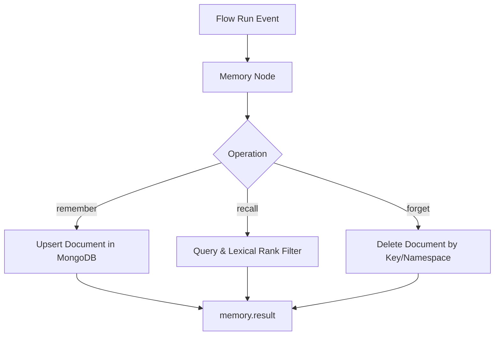
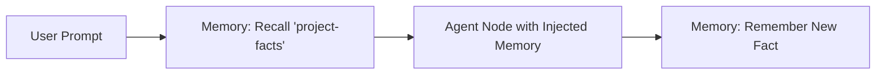

# Memory Tool Documentation & Usage Guide

The **Memory** node provides long-term, scoped memory management across workflow executions, conversations, and projects. It allows agents and flows to persist facts, user preferences, historical summaries, and cross-run context in MongoDB, and selectively recall them using term-based lexical ranking.

---

## Table of Contents
1. [Overview & Architecture](#1-overview--architecture)
2. [Node Inputs & Configuration](#2-node-inputs--configuration)
3. [Memory Operations](#3-memory-operations)
   - [Remember](#remember)
   - [Recall](#recall)
   - [Forget](#forget)
4. [Lexical Scoring & Relevance Ranking](#4-lexical-scoring--relevance-ranking)
5. [Outputs & Schema](#5-outputs--schema)
6. [Real-World Recipes & Patterns](#6-real-world-recipes--patterns)
7. [Best Practices](#7-best-practices)

---

## 1. Overview & Architecture

Unlike ephemeral in-memory graph variables that disappear when a workflow run completes, the Memory node stores durable records in MongoDB:
- **Project Scoping (`projectId`)**: Every memory record is indexed and scoped by `projectId` (compound index `{ projectId: 1, namespace: 1, key: 1 }`), ensuring strict multi-tenant isolation across workspaces.
- **Namespacing**: Partitions memories within a project by tenant, user ID, or workflow session (`namespace`).
- **Categorization**: Groups memories by `kind` (e.g. `"user-preference"`, `"project-fact"`, `"conversation-history"`).
- **Lexical Relevance Ranking**: Matches search terms against stored memory values and ranks results by combined keyword density and importance score.
- **In-Place Upsert**: Re-remembering the same `key` in the same `namespace` updates the existing record with new values without creating duplicates.



---

## 2. Node Inputs & Configuration

| Input Field | Type | Required | Default | Description |
| :--- | :--- | :--- | :--- | :--- |
| `operation` | `select` | Yes | `"recall"` | Target action: `"remember"`, `"recall"`, or `"forget"`. |
| `projectId` | `valueOrVariable` | No | Active project ID | Owning project identifier. Defaults to the running flow's `projectId`. |
| `namespace` | `text` | No | `"default"` | Scoping namespace within the project (e.g. `userId` or session name). |
| `key` | `valueOrVariable` | Conditional | `null` | Unique memory key (e.g. `"user_pref_theme"`, `"last_commit_hash"`). |
| `value` | `json` | Conditional | `null` | Data payload or object to remember. |
| `query` | `valueOrVariable` | Conditional | `null` | Natural language text query to rank memories during `recall`. |
| `kind` | `text` | No | `null` | Logical grouping tag (e.g. `"preference"`, `"fact"`, `"summary"`). |

---

## 3. Memory Operations

### Remember
Persists or updates a memory record. If a record with the same `namespace` and `key` exists, it is updated in-place.

```json
{
  "operation": "remember",
  "namespace": "project-builder",
  "key": "preferred_language",
  "kind": "preference",
  "value": {
    "language": "TypeScript",
    "framework": "NestJS",
    "strictMode": true
  }
}
```

### Recall
Searches memories within a `namespace`. If a `query` string is provided, memories are scored based on how many query terms appear in the document, sorted by relevance and importance.

```json
{
  "operation": "recall",
  "namespace": "project-builder",
  "kind": "preference",
  "query": "NestJS TypeScript"
}
```

### Forget
Removes a specific memory by key or clears all memories within a namespace.

```json
{
  "operation": "forget",
  "namespace": "project-builder",
  "key": "preferred_language"
}
```

---

## 4. Lexical Scoring & Relevance Ranking

When `operation` is `"recall"` with a `query`:
1. The search query is tokenized into individual terms (e.g. `"nestjs"` and `"typescript"`).
2. For each candidate document in the namespace, the system counts matching terms across the serialized record.
3. Only documents with at least one matching term (`score > 0`) are returned.
4. Each record is augmented with a computed `relevance` score (`score / totalTerms`) between `0.0` and `1.0` and sorted descending.

---

## 5. Outputs & Schema

The Memory node provides a single output handle:

- **`result`** (`array` or `object`): Output payload.

### Recall Output Example
```json
{
  "status": "completed",
  "result": [
    {
      "projectId": "6a99bcfc636072bb867a0bad",
      "namespace": "project-builder",
      "key": "preferred_language",
      "kind": "preference",
      "value": {
        "language": "TypeScript",
        "framework": "NestJS"
      },
      "importance": 5,
      "relevance": 1.0,
      "updatedAt": "2026-09-02T22:00:00.000Z"
    }
  ]
}
```

### Forget Output Example
```json
{
  "status": "completed",
  "result": {
    "deletedCount": 1
  }
}
```

---

## 6. Real-World Recipes & Patterns

### Recipe 1: Contextual Recall Before Agent Reasoning
Recall relevant project preferences to prepend to the Agent's system prompt:



### Recipe 2: Storing User Session State Across Disconnected Workflows
Save state between separate webhook triggers using the user's ID as `namespace`:

```json
{
  "operation": "remember",
  "namespace": "{{trigger.input.userId}}",
  "key": "onboarding_step",
  "value": { "completedStep": 3, "timestamp": "{{runId}}" }
}
```

---

## 7. Best Practices

1. **Project & Namespace Partitioning**: Memories are automatically partitioned by the active `projectId`. Combine this with a specific `namespace` (such as a `userId`, flow name, or session ID) to achieve clean multi-tenant and session isolation.
2. **Use Descriptive Keys**: Name keys predictably (e.g. `auth_token_status`, `user_profile`) for deterministic upserts.
3. **Combine with Agent Reasoning**: Pass the array from `memory.result` directly into an Agent's prompt template using `{{nodes.memory_1.result}}`.
