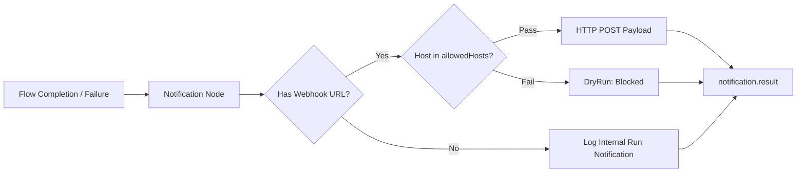

# Notification Tool Documentation & Usage Guide

The **Notification** node dispatches messages, alerts, and execution payloads to external webhooks (Slack, Discord, Microsoft Teams, custom endpoints) or records internal notification events. It keeps human operators, team chat channels, and monitoring services updated on workflow milestones or failures.

---

## Table of Contents
1. [Overview & Architecture](#1-overview--architecture)
2. [Node Inputs & Configuration](#2-node-inputs--configuration)
3. [Notification Channels & Modes](#3-notification-channels--modes)
   - [Webhook Dispatch Mode](#webhook-dispatch-mode)
   - [Internal Event Recording Mode](#internal-event-recording-mode)
4. [Security & Allowed Hosts](#4-security--allowed-hosts)
5. [Outputs & Schema](#5-outputs--schema)
6. [Real-World Recipes](#6-real-world-recipes)
7. [Best Practices](#7-best-practices)

---

## 1. Overview & Architecture

Workflows often run asynchronously in the background. The Notification node ensures stakeholders are informed at the right moment:
- **Webhook Integration**: Posts JSON payloads directly to incoming webhook URLs (Slack, Discord, PagerDuty).
- **Security Sandboxing**: Validates outbound webhook URLs against `allowedHosts` to safeguard internal network environments.
- **Internal Channel Tracking**: When no external URL is specified, logs the notification event in the internal run stream.



---

## 2. Node Inputs & Configuration

| Input Field | Type | Required | Default | Description |
| :--- | :--- | :--- | :--- | :--- |
| `channel` | `text` | No | `"internal"` | Target channel name (e.g. `"internal"`, `"slack"`, `"discord"`, `"email"`). |
| `recipient` | `text` | No | `null` | Target user handle, email, or chat channel name (e.g. `"#dev-alerts"`). |
| `message` | `valueOrVariable` | No | `null` | Message content string or structured payload. Supports variable interpolation. |
| `url` | `text` | No | `null` | Target webhook URL (e.g. `https://hooks.slack.com/...`). |
| `allowedHosts` | `json` | No | `null` | Array of permitted webhook domains (e.g. `["hooks.slack.com", "discord.com"]`). |

---

## 3. Notification Channels & Modes

### Webhook Dispatch Mode
When `url` is configured:
1. Validates the URL and checks the hostname against `allowedHosts`.
2. Sends an HTTP `POST` request with headers `{"content-type": "application/json"}`.
3. Passes the node's input or message as the serialized request body.
4. Returns the response from the receiving webhook server.

```json
{
  "channel": "slack",
  "url": "https://hooks.slack.com/services/T00/B00/XXXXX",
  "message": {
    "text": "Deployment complete for workflow {{runId}}"
  },
  "allowedHosts": ["hooks.slack.com"]
}
```

### Internal Event Recording Mode
When `url` is omitted:
- Records the notification as an internal event associated with the active run.
- Emits `{ delivered: false, channel: "internal", payload: ... }`.

---

## 4. Security & Allowed Hosts

To protect workflows from SSRF when triggering webhooks dynamically:
- Specify all trusted notification endpoints in `allowedHosts`.
- If an unlisted destination is targeted, the request is safely blocked with `blocked: true` and `dryRun: true`.

---

## 5. Outputs & Schema

The Notification node outputs a single `result` object:

### Webhook Success Output Schema
```json
{
  "status": "completed",
  "result": {
    "provider": "http",
    "action": "request",
    "status": 200,
    "ok": true,
    "headers": {
      "content-type": "text/html"
    },
    "body": "ok"
  }
}
```

### Internal Channel Output Schema
```json
{
  "status": "completed",
  "result": {
    "delivered": false,
    "channel": "internal",
    "payload": {
      "message": "Artifact PRD-Checkout approved by reviewer."
    }
  }
}
```

---

## 6. Real-World Recipes

### Recipe 1: Slack Alert on Workflow Failure
Attach to the `false` branch of a **Verification** or **Condition** node:

```json
{
  "channel": "slack",
  "recipient": "#engineering-oncall",
  "url": "https://hooks.slack.com/services/T00/B00/FAILED",
  "message": {
    "text": "🚨 Workflow test verification failed for run `{{runId}}`.\nError: `{{nodes.verification_1.result.stderr}}`"
  },
  "allowedHosts": ["hooks.slack.com"]
}
```

### Recipe 2: Microsoft Teams Deployment Webhook
Notify release channels when artifact is promoted:

```json
{
  "channel": "teams",
  "url": "https://outlook.office.com/webhook/xxxxxx",
  "message": {
    "@type": "MessageCard",
    "title": "Artifact Published",
    "text": "Artifact **{{nodes.artifact_1.title}}** (version {{nodes.artifact_1.version}}) was approved and archived."
  },
  "allowedHosts": ["outlook.office.com"]
}
```

---

## 7. Best Practices

1. **Keep Payloads Concise**: Chat integrations (Slack, Teams, Discord) enforce length limits on message blocks; summarize large payloads before dispatch.
2. **Always Use Allowed Hosts**: Include webhook domains in `allowedHosts` to adhere to security best practices.
3. **Notify on Terminal States**: Place notification nodes at the terminal endpoints of flows (success or failure) to give users closure on long-running executions.
