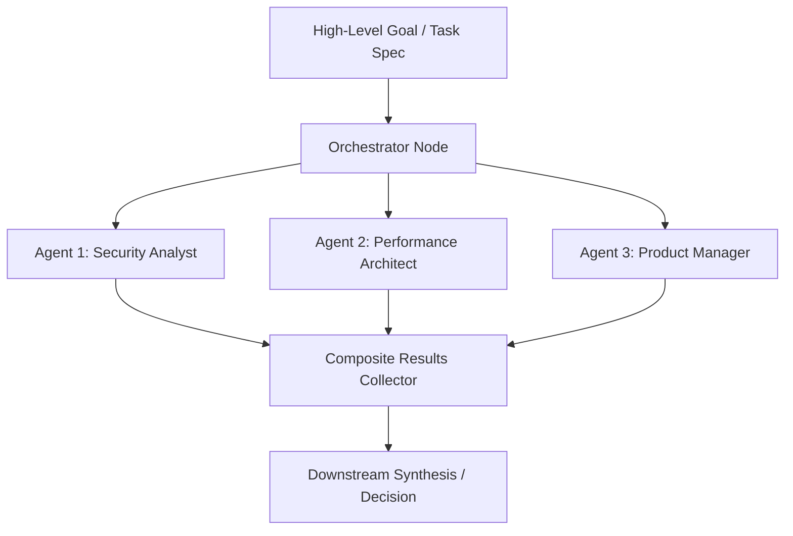

# Orchestrator Tool Documentation & Usage Guide

The **Orchestrator** node coordinates multi-agent systems by delegating a overarching goal or user objective to multiple specialized sub-agents and aggregating their distinct outputs into a composite result. It enables patterns such as multi-persona committees, specialized expert panels, and division-of-labor problem solving.

---

## Table of Contents
1. [Overview & Architecture](#1-overview--architecture)
2. [Node Inputs & Configuration](#2-node-inputs--configuration)
3. [Delegation Strategies](#3-delegation-strategies)
   - [Parallel Fan-Out](#parallel-fan-out)
   - [Sequential Pipeline](#sequential-pipeline)
4. [Outputs & Composite Schema](#4-outputs--composite-schema)
5. [Real-World Recipes & Patterns](#5-real-world-recipes--patterns)
   - [Recipe 1: Triple-Perspective Review Committee](#recipe-1-triple-perspective-review-committee)
   - [Recipe 2: Multi-Language Translation Squad](#recipe-2-multi-language-translation-squad)
6. [Best Practices](#6-best-practices)

---

## 1. Overview & Architecture

Complex problems require multiple perspectives (e.g. Security, Performance, and Product). Rather than asking a single LLM prompt to pretend to be multiple roles sequentially, the Orchestrator node fans out tasks to dedicated sub-agents:
- **Autonomous Agent Instantiation**: Spawns sub-agents configured with custom roles, system prompts, models, and temperature parameters.
- **Concurrent Fan-Out**: Runs multiple agents in parallel via `Promise.all` to drastically minimize wall-clock latency.
- **Structured Aggregation**: Gathers all sub-agent findings into an indexed results array containing agent IDs, roles, and typed payloads.



---

## 2. Node Inputs & Configuration

| Input Field | Type | Required | Default | Description |
| :--- | :--- | :--- | :--- | :--- |
| `goal` | `valueOrVariable` | Yes | `null` | The primary goal, prompt, or payload delegated to the sub-agents. |
| `agents` | `json` | Yes | `[]` | Array of agent definition objects specifying IDs, roles, prompts, and models. |
| `strategy` | `select` | No | `"parallel"` | Execution strategy: `"parallel"` or `"sequential"`. |

---

## 3. Delegation Strategies

### Parallel Fan-Out
Runs all configured agents concurrently:
- Lowest latency.
- Best when agents do not depend on each other's outputs (e.g. independent audits or translation into multiple languages).

### Sequential Pipeline
Runs agents in order, useful when downstream agents must build upon intermediate deliverables.

---

## 4. Outputs & Composite Schema

The Orchestrator node produces a single `result` object:

### Aggregated Result Schema
```json
{
  "status": "completed",
  "result": {
    "goal": "Review the proposed Stripe payment integration architecture.",
    "agentCount": 2,
    "results": [
      {
        "id": "security-reviewer",
        "role": "security",
        "result": {
          "status": "completed",
          "vulnerabilities": [],
          "recommendation": "Enforce webhook signature verification."
        }
      },
      {
        "id": "performance-architect",
        "role": "architecture",
        "result": {
          "status": "completed",
          "latencyRisk": "low",
          "recommendation": "Use idempotency keys on payment intent retries."
        }
      }
    ]
  }
}
```

---

## 5. Real-World Recipes & Patterns

### Recipe 1: Triple-Perspective Review Committee
Configure three expert personas to analyze a system proposal:

```json
{
  "goal": "{{trigger.input.proposalText}}",
  "strategy": "parallel",
  "agents": [
    {
      "id": "product-agent",
      "name": "Product Manager",
      "role": "product",
      "prompt": "Evaluate the proposal for user value and business viability. Return JSON with pros, cons, and score.",
      "outputFormat": "json"
    },
    {
      "id": "security-agent",
      "name": "SecOps Engineer",
      "role": "security",
      "prompt": "Inspect the architecture for authentication vulnerabilities and compliance risks. Return JSON.",
      "outputFormat": "json"
    },
    {
      "id": "tech-lead",
      "name": "Lead Architect",
      "role": "architecture",
      "prompt": "Evaluate scalability, database performance, and technical complexity. Return JSON.",
      "outputFormat": "json"
    }
  ]
}
```

### Downstream Synthesis
Pass `{{nodes.orchestrator_1.result.results}}` into a subsequent **Agent** node to reconcile differing opinions and make a final go/no-go determination.

---

## 6. Best Practices

1. **Structured Agent Outputs**: Set `"outputFormat": "json"` for each delegated agent so their outputs can be queried by downstream nodes without manual text parsing.
2. **Assign Distinct Roles**: Give each sub-agent a sharply defined role and evaluation criteria to prevent redundant or overlapping answers.
3. **Monitor Rate Limits**: When fanning out 5+ agents in parallel, ensure your LLM provider account has sufficient Requests Per Minute (RPM) limits.
