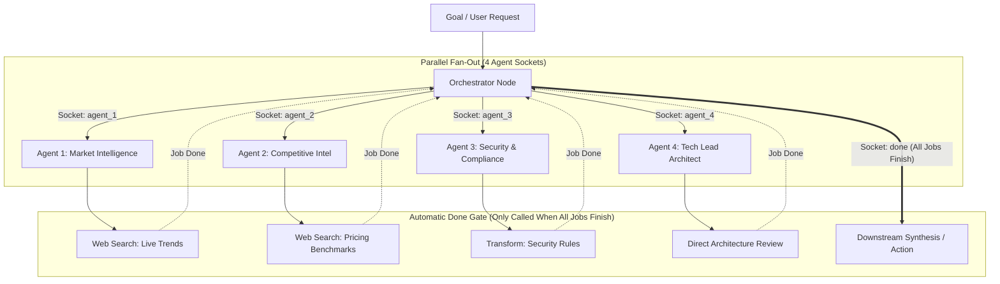
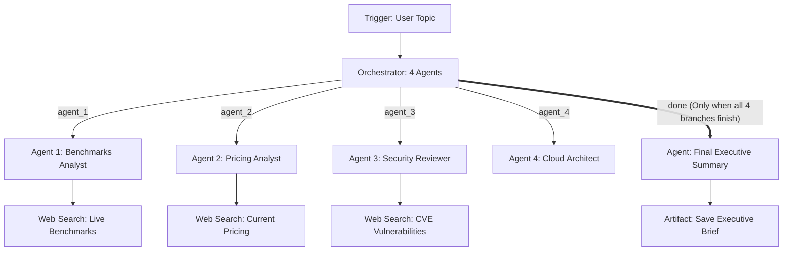

# Orchestrator Tool Documentation & Usage Guide

The **Orchestrator** node coordinates multi-agent systems visually on the Flow Builder canvas. Rather than concealing sub-agents inside an opaque JSON configuration, the Orchestrator asks the user to configure explicit **agent outputs**, where each output connects directly to an independent **Agent** block on the canvas, plus an additional output dedicated to when all jobs finish: **`done` (Done / Jobs Finish)**.

For example, when a user specifies **4 agents in parallel**, the Orchestrator node provides **5 outputs**:
- **4 outputs** for the LLM agents (`agent_1`, `agent_2`, `agent_3`, `agent_4`), each wired to a separate Agent node on the canvas.
- **1 output** called **`done`** (with `result` alias), which is **only called when all jobs finish**!

### Simplified Downstream Wiring (No Multi-Wire Clutter)
To make orchestration easier, users do **not** need to wire multiple edges from every agent and web search tool into a separate join node. Simply connect the Orchestrator's **`done`** handle directly to the downstream step (e.g. Synthesis Agent, DB Save, or Notification). The runtime engine automatically holds back `done` until all delegated jobs and chained tool sub-pipelines complete, and only then triggers downstream execution with the aggregated findings.

Furthermore, there is **no architectural limitation** on what downstream branches can do. Any agent branch can chain directly into specialized tool nodes:
$$\text{Orchestrator} \xrightarrow{\text{agent\_1}} \text{Agent} \xrightarrow{\text{flow}} \text{Web Search} \xrightarrow{} \cdots$$
$$\text{Orchestrator} \xrightarrow{\text{done (only when all jobs finish)}} \text{Synthesis / Next Step}$$

---

## Table of Contents
1. [Overview & Visual Architecture](#1-overview--visual-architecture)
2. [Configuring Dynamic Outputs](#2-configuring-dynamic-outputs)
   - [The 5-Output Model (4 Agents + 1 Done Handle)](#the-5-output-model-4-agents--1-done-handle)
   - [Adding and Customizing Outputs](#adding-and-customizing-outputs)
3. [The `done` Output: Only Called When Jobs Finish](#3-the-done-output-only-called-when-jobs-finish)
4. [Node Inputs & Configuration](#4-node-inputs--configuration)
5. [Canvas Wiring & Handle Connections](#5-canvas-wiring--handle-connections)
6. [Execution Strategies & Automatic Synchronization](#6-execution-strategies--automatic-synchronization)
   - [Parallel Fan-Out & Automatic Job Completion](#parallel-fan-out--automatic-job-completion)
   - [Sequential Pipeline](#sequential-pipeline)
7. [Unconstrained Sub-Pipelines: Orchestrator &rarr; Agent &rarr; Web Search](#7-unconstrained-sub-pipelines-orchestrator--agent--web-search)
8. [Outputs & Schema Reference](#8-outputs--schema-reference)
   - [Individual Agent Dispatches](#individual-agent-dispatches)
   - [Composite `done` / `result` Schema](#composite-done--result-schema)
9. [Real-World Recipes & Patterns](#9-real-world-recipes--patterns)
   - [Recipe 1: 4 Parallel Specialized Agents with Autonomous Web Search and Done Join](#recipe-1-4-parallel-specialized-agents-with-autonomous-web-search-and-done-join)
   - [Recipe 2: Multi-Persona Code Audit Squad](#recipe-2-multi-persona-code-audit-squad)
10. [Downstream Variable Referencing](#10-downstream-variable-referencing)
11. [Best Practices](#11-best-practices)

---

## 1. Overview & Visual Architecture

Visual multi-agent workflows require clear visibility into every persona, model choice, prompt, and tool execution. By exposing discrete output handles for each delegated agent plus a dedicated completion handle, the Orchestrator enables:
- **Canvas-Level Observability**: See all parallel agents directly on the graph canvas rather than hidden within modal JSON parameters.
- **Independent Agent Configuration**: Each connected Agent node can independently configure its own LLM model (e.g. GPT-4o, Claude 3.5 Sonnet, Gemini Flash), custom system instructions, temperature, structured output schema, and autonomous tool allowlists.
- **Unconstrained Tool Chaining**: An Agent node can connect to a `web-search` node, browser automation node, custom scripts, or subgraphs before returning its findings.
- **Single-Socket Clean Join (`done`)**: No need to draw 4+ converging lines back across the canvas. When all parallel branches finish their work (including all chained web searches), the `done` socket automatically fires.
- **Unified Coordination & Last Result**: The Orchestrator collects all findings and provides them through `{{orchestrator.done}}` and `{{orchestrator.result}}`.



---

## 2. Configuring Dynamic Outputs

### The 5-Output Model (4 Agents + 1 Done Handle)

When setting up parallel multi-agent collaboration, the user defines the agents needed for the task. For $N$ parallel agents, the Orchestrator renders $N + 1$ output handles:

| Output Socket | Type | Destination | Purpose |
| :--- | :--- | :--- | :--- |
| `agent_1` | `branch` | Agent Node 1 | Task, role context, and payload for Agent 1 |
| `agent_2` | `branch` | Agent Node 2 | Task, role context, and payload for Agent 2 |
| `agent_3` | `branch` | Agent Node 3 | Task, role context, and payload for Agent 3 |
| `agent_4` | `branch` | Agent Node 4 | Task, role context, and payload for Agent 4 |
| `done` | `branch` | Downstream Flow | **Only called when all agent jobs finish**, emitting composite results |

### Adding and Customizing Outputs

In the Orchestrator configuration modal, the user can add, edit, or rename outputs:
1. **Agent Outputs Array**: In `agentOutputs`, declare the list of agent handles (e.g. `agent_1` to `agent_4`, or custom names like `web_researcher`, `critic`, `coder`, `compliance_auditor`).
2. **Handle Name & Role**: Assign a semantic name and role description for each output.
3. **Dedicated Task Instructions**: Provide a dedicated sub-task directive for each output handle, or let the agent inherit the master `goal`.
4. **Permanent `done` Socket**: The `done` output is always present to provide downstream nodes with the final aggregated payload or continuation signal once all jobs finish.

```json
{
  "goal": "Evaluate production readiness of our payment service microservice.",
  "strategy": "parallel",
  "agentOutputs": [
    { "name": "agent_1", "label": "Market Intelligence", "role": "market-analyst" },
    { "name": "agent_2", "label": "Competitive Intel", "role": "pricing-researcher" },
    { "name": "agent_3", "label": "Security Specialist", "role": "security-auditor" },
    { "name": "agent_4", "label": "Cloud Architect", "role": "system-architect" }
  ]
}
```

---

## 3. The `done` Output: Only Called When Jobs Finish

The `done` handle solves the most common problem in multi-agent canvas workflows: **complex join wiring**.

- **Traditional approach (Messy)**: If you run 4 agents, you have to draw 4 separate lines from each agent (and from any web search nodes they use) into an Aggregate node or Synthesis Agent. This creates messy, overlapping canvas wires.
- **The Orchestrator `done` handle (Clean)**: You draw only **1 edge** from the Orchestrator's `done` socket to the downstream node.
- **Execution Guarantee**: The flow execution engine identifies all nodes belonging to the agent jobs spawned by the Orchestrator. The node connected to `done` is held in a pending state and **only called after every single agent job and chained tool execution has finished**.
- **Aggregated Findings**: When `done` fires, the Orchestrator automatically consolidates the outputs of all completed jobs into `{{orchestrator.done.results}}`.

---

## 4. Node Inputs & Configuration

| Input Field | Type | Required | Default | Description |
| :--- | :--- | :--- | :--- | :--- |
| `goal` | `valueOrVariable` | Yes | `null` | High-level objective, query, or payload to coordinate across agents. |
| `agentOutputs` | `json` | No | `4 outputs` | User-configured list of agent outputs. Each item generates an output socket on the node card. |
| `strategy` | `select` | No | `"parallel"` | Execution strategy: `"parallel"` (concurrent fan-out) or `"sequential"` (ordered handoff). |
| `sharedInput` | `valueOrVariable` | No | `null` | Optional global context payload distributed to all agent sockets. |
| `concurrency` | `number` | No | `4` | Maximum concurrent active agent executions (1–4). |
| `failFast` | `checkbox` | No | `false` | Halt remaining dispatches immediately if any connected agent errors. |

---

## 5. Canvas Wiring & Handle Connections

On the Flow Builder canvas, the Orchestrator node card displays discrete bottom source handles:

```
+---------------------------------------------------------------+
|                        [Orchestrator]                         |
|            Goal: "Conduct 4-way PR & System Review"           |
+---------------------------------------------------------------+
    o            o            o            o            o
[agent_1]    [agent_2]    [agent_3]    [agent_4]     [done]
    |            |            |            |            |
    v            v            v            v            |
 (Agent 1)    (Agent 2)    (Agent 3)    (Agent 4)       | (Waits until
    |            |                                      |  all jobs finish)
    v            v                                      |
(WebSearch)  (WebSearch)                                |
                                                        v
                                                   (Downstream)
```

1. **Connect Agent Sockets**: Drag an edge from `agent_1` to the top target handle of the first **Agent** node. Repeat for `agent_2`, `agent_3`, and `agent_4`.
2. **Chain into Downstream Tools**: Drag an edge from an Agent node to a **Web Search** or tool node (e.g. `Agent 1` &rarr; `WebSearch 1`).
3. **Connect the `done` Socket**: Drag a single edge from `done` to your downstream node (e.g. Synthesis Agent or Save to DB). It will only be called after all 4 branches and both WebSearch jobs have completed!

---

## 6. Execution Strategies & Automatic Synchronization

### Parallel Fan-Out & Automatic Job Completion

When `strategy: "parallel"`:
1. The Orchestrator fires `agent_1`, `agent_2`, `agent_3`, and `agent_4` simultaneously.
2. The `done` socket remains dormant while the agent branches execute.
3. The 4 Agent nodes run in parallel. When Agent 1 triggers Web Search, that web search job executes as part of the branch.
4. **Automatic Completion Detection**: As soon as all 4 branches—including the web search executions—finish, the topology runner detects that all orchestrated jobs are complete.
5. **`done` Socket Fires**: The runtime consolidates all agent outputs into `{{orchestrator.done}}` and schedules the node connected to `done`.

### Sequential Pipeline

When `strategy: "sequential"`:
1. `agent_1` fires first with `{ goal, task }`.
2. Agent 1 (and any chained tool like Web Search) completes.
3. `agent_2` fires next with `{ goal, task, priorResults: [agent_1] }`.
4. The pipeline steps through `agent_3` and `agent_4` in order.
5. Once all steps complete, the `done` output fires.

---

## 7. Unconstrained Sub-Pipelines: Orchestrator &rarr; Agent &rarr; Web Search

There is no limit to what can follow an agent socket:

$$\text{Orchestrator} \xrightarrow{\text{agent\_1}} \text{Agent 1} \xrightarrow{\text{flow}} \text{Web Search} \xrightarrow{} \cdots$$
$$\text{Orchestrator} \xrightarrow{\text{done}} \text{Downstream Synthesis}$$

### How Web Search Chaining Works:
1. **Orchestrator Dispatches Goal**: Emits `{ goal: "Research 2026 vector DB benchmarks", agentId: "agent_1" }`.
2. **Agent Generates Search Query**: Agent 1 analyzes the goal and outputs `{ query: "vector database benchmarks milvus qdrant 2026" }`.
3. **Web Search Executes**: The connected `web-search` node runs the live web query and returns clean search results, sources, and snippets.
4. **Synchronization**: When the search finishes, the Orchestrator notes that this branch is complete.
5. **Proceed**: As soon as all parallel branches finish their web searches and computations, the `done` handle fires automatically.

---

## 8. Outputs & Schema Reference

### Individual Agent Dispatches (`agent_1` to `agent_4`)

Each agent output socket delivers a structured handoff payload to its connected Agent node:

```json
{
  "goal": "Investigate vector database production readiness in 2026.",
  "agentId": "agent_1",
  "role": "market-analyst",
  "task": "Investigate benchmarks and market adoption of Milvus vs Qdrant.",
  "sharedInput": {
    "focusYear": 2026,
    "topK": 5
  }
}
```

### Composite `done` / `result` Schema

When all jobs finish, the `done` (and `result`) socket produces the comprehensive orchestration output:

```json
{
  "status": "completed",
  "goal": "Investigate vector database production readiness in 2026.",
  "agentCount": 4,
  "results": [
    {
      "id": "agent_1",
      "name": "Market Intelligence",
      "type": "agent",
      "output": { "topEngine": "Qdrant", "benchmarkQps": 12400 }
    },
    {
      "id": "websearch_1",
      "name": "Live Search Milvus",
      "type": "web-search",
      "output": { "results": ["Milvus 2.4 released with GPU indexing..."] }
    },
    {
      "id": "agent_2",
      "name": "Competitive Intel",
      "type": "agent",
      "output": { "pricingTier": "open-source Apache 2.0" }
    },
    {
      "id": "agent_3",
      "name": "Security Specialist",
      "type": "agent",
      "output": { "tlsSupported": true, "rbac": "enabled" }
    },
    {
      "id": "agent_4",
      "name": "Cloud Architect",
      "type": "agent",
      "output": { "haClustering": "Raft-based consensus" }
    }
  ],
  "lastResult": {
    "haClustering": "Raft-based consensus"
  }
}
```

---

## 9. Real-World Recipes & Patterns

### Recipe 1: 4 Parallel Specialized Agents with Autonomous Web Search and Done Join



Notice the clean architecture:
- 4 agents fan out and run their web searches independently.
- Only **1 single edge** from `done` connects to the Synthesis Agent.
- The Synthesis Agent waits until all 3 web searches and the 4th architecture analysis finish, then executes with all findings ready in `{{orchestrator.done.results}}`.

---

### Recipe 2: Multi-Persona Code Audit Squad

Fan out an incoming Pull Request diff across 4 specialized review perspectives simultaneously, and save the final report when all finish:

```json
{
  "goal": "{{trigger.data.prDiff}}",
  "strategy": "parallel",
  "agentOutputs": [
    { "name": "syntax_cleaner", "role": "clean-code-reviewer" },
    { "name": "security_scanner", "role": "owasp-top-10-auditor" },
    { "name": "test_coverage", "role": "unit-test-evaluator" },
    { "name": "api_contract", "role": "backward-compatibility-checker" }
  ]
}
```

Wire `syntax_cleaner`, `security_scanner`, `test_coverage`, and `api_contract` to Agent nodes, and wire `done` to an Artifact block to save the consolidated report.

---

## 10. Downstream Variable Referencing

Downstream nodes can reference outputs via standard variable syntax:

| Path | Description |
| :--- | :--- |
| `{{orchestrator.agent_1}}` | Dispatched task payload for Agent 1. |
| `{{orchestrator.agent_2}}` | Dispatched task payload for Agent 2. |
| `{{orchestrator.agent_3}}` | Dispatched task payload for Agent 3. |
| `{{orchestrator.agent_4}}` | Dispatched task payload for Agent 4. |
| `{{orchestrator.done}}` | Aggregated output delivered when all jobs finish. |
| `{{orchestrator.done.results}}` | Array of all completed agent and tool outcomes. |
| `{{orchestrator.done.lastResult}}` | The most recent completed job's output. |
| `{{orchestrator.result}}` | Equivalent alias to `done`. |

---

## 11. Best Practices

1. **Use `done` for Clean Workflows**: Instead of cluttering the canvas with return wires from each agent to a join node, use the Orchestrator's `done` output to trigger downstream steps.
2. **Chain Specialized Tools Freely**: Connect `Agent` &rarr; `WebSearch` or `Agent` &rarr; `Browser` &rarr; `Transform`. The topology engine guarantees that `done` only fires when the entire branch, including all tools, is finished.
3. **Use Semantic Handle Names**: Instead of generic names (`agent_1`, `agent_2`), give handles descriptive names like `benchmarks_agent`, `pricing_agent`, and `security_agent`.
4. **Structured JSON from Agents**: Configure each connected Agent node with `outputFormat: "json"` so chained web search nodes can consume clean query parameters (e.g. `{{agent_1.result.searchQuery}}`).
