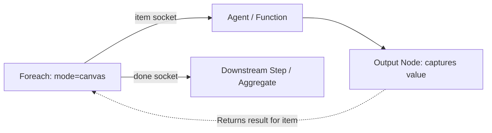

# Output Tool Documentation & Usage Guide

The **Output** node defines the return boundary for in-canvas loop branches (`Foreach`) or flow-level exit payloads. It captures values produced by upstream nodes (e.g. LLM agent reasoning, function transformations, or database results) and transmits them back to the caller.

---

## Table of Contents
1. [Overview & Architecture](#1-overview--architecture)
2. [Node Inputs & Configuration](#2-node-inputs--configuration)
3. [Loop Branch Return Behavior](#3-loop-branch-return-behavior)
4. [Outputs & Schema](#4-outputs--schema)
5. [Real-World Recipes & Integration Patterns](#5-real-world-recipes--integration-patterns)
6. [Best Practices](#6-best-practices)

---

## 1. Overview & Architecture

When running in-canvas loops with **`Foreach`**, each iteration runs a sequence of nodes on the same board. The **`Output`** node serves as the explicit termination boundary:
- It halts traversal along that iteration branch so execution doesn't bleed into outer workflow nodes.
- It extracts the configured `value` or variable and sets it as the final result for that specific iteration item.
- When all iterations finish, `Foreach` aggregates all `Output` results into its unified `result.items` collection.



---

## 2. Node Inputs & Configuration

| Input Field | Type | Required | Default | Description |
| :--- | :--- | :--- | :--- | :--- |
| `value` | `valueOrVariable` | Yes | - | The value or variable to return (e.g. `{{agent_1.result}}`, `{{script_1.transformed}}`, or literal data). Accepts `any`, `object`, `array`, `string`, `number`, `boolean`. |
| `name` | `text` | No | - | Optional key name to wrap the returned value under (e.g. `"analysis"` produces `{ "analysis": ... }`). |

---

## 3. Loop Branch Return Behavior

1. **Explicit Boundary**: The engine treats the `Output` node as the terminal node of an iteration branch. No further downstream nodes along that branch are executed.
2. **Payload Resolution**: The `value` field is evaluated against the current iteration's context (which includes `{{foreach.item}}`, `{{foreach.index}}`, and any intermediate nodes executed in that branch).
3. **Key Wrapping**:
   - If `name` is omitted: Returns `{ "value": <value>, "result": <value> }`.
   - If `name` is `"summary"`: Returns `{ "summary": <value>, "value": <value>, "result": <value> }`.
4. **Aggregated Collection**: In `Foreach` synchronous mode, each item's output is recorded in `foreach.result.items[i].result`.

---

## 4. Outputs & Schema

The Output node outputs a standard `result` object:

```json
{
  "value": { "score": 95, "category": "A" },
  "result": { "score": 95, "category": "A" }
}
```

If `name` is specified (e.g. `"audit"`):
```json
{
  "audit": { "score": 95, "category": "A" },
  "value": { "score": 95, "category": "A" },
  "result": { "score": 95, "category": "A" }
}
```

---

## 5. Real-World Recipes & Integration Patterns

### Recipe: In-Canvas Document Analysis Loop
Iterate over a list of documents, analyze each with an Agent, and collect structured responses:

1. **`Artifact` Node**: List documents (`operation: list`).
2. **`Foreach` Node**:
   - `mode`: `"canvas"`
   - `items`: `{{artifact_1.artifacts}}`
   - `concurrency`: `3`
3. Connect `Foreach [item socket]` &rarr; **`Agent`**:
   - Prompt: `"Analyze document: {{foreach_1.item.content}}"`
4. Connect `Agent` &rarr; **`Output`**:
   - `value`: `{{agent_1.result}}`
5. Connect `Foreach [done socket]` &rarr; **`Aggregate`** or **`Telegram`**:
   - Receives the collected list of all analysis results.

---

## 6. Best Practices

1. **Place at Branch End**: Always position the `Output` node as the final block in the loop branch.
2. **Select Specific Variable Fields**: If an upstream node outputs complex metadata, select the exact sub-property needed (e.g. `{{agent_1.result.summary}}` instead of whole state) to keep memory usage low.
3. **Combine with Aggregate**: Pass the output of `Foreach [done]` into an **Aggregate** block to filter successful vs. failed item outputs.
