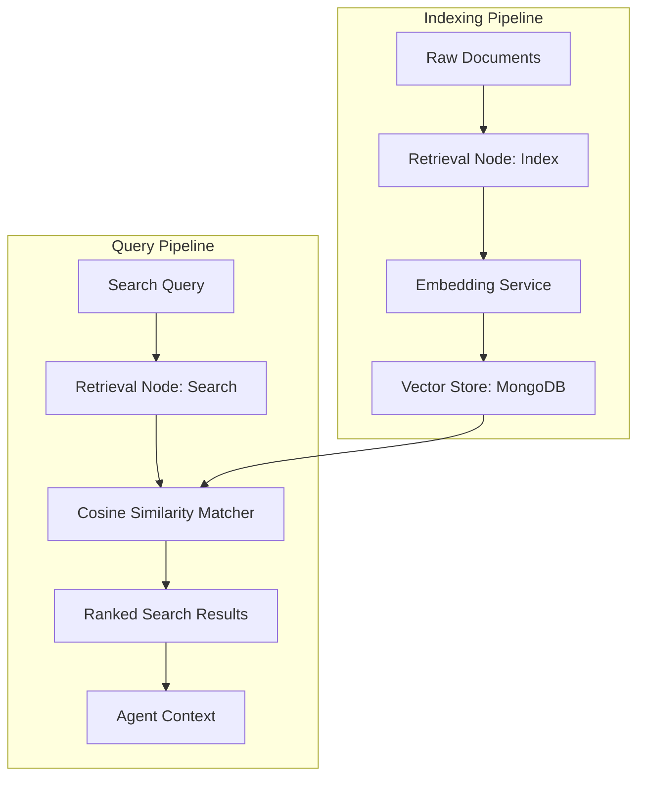
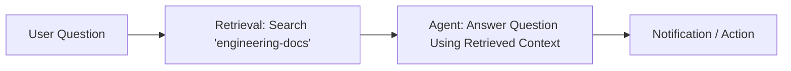

# Retrieval Tool Documentation & Usage Guide

The **Retrieval** node provides semantic vector search and automated document indexing over vector embeddings. It serves as the core Retrieval-Augmented Generation (RAG) engine for Flow Builder, allowing agents to index documents, search knowledge bases using vector similarity, and extract relevant contextual snippets.

---

## Table of Contents
1. [Overview & Architecture](#1-overview--architecture)
2. [Node Inputs & Configuration](#2-node-inputs--configuration)
3. [Operations](#3-operations)
   - [Search Mode](#search-mode)
   - [Index / Upsert Mode](#index--upsert-mode)
4. [Vector Store & Cosine Similarity](#4-vector-store--cosine-similarity)
5. [Outputs & Schema](#5-outputs--schema)
6. [Real-World Recipes & Pipelines](#6-real-world-recipes--pipelines)
7. [Best Practices](#7-best-practices)

---

## 1. Overview & Architecture

The Retrieval node connects text generation workflows to vector knowledge stores:
- **Automatic Vectorization**: If an embedding vector is not provided during `search` or `index`, the node automatically calls the internal `EmbeddingService` to vectorize the text on the fly.
- **Scoring via Cosine Similarity**: Computes exact cosine similarity scores (`-1.0` to `1.0`) against stored candidate vectors.
- **Multi-Dimensional Metadata Filtering**: Scopes queries by `namespace`, `projectId`, `sourceType`, and `status`.



---

## 2. Node Inputs & Configuration

| Input Field | Type | Required | Default | Description |
| :--- | :--- | :--- | :--- | :--- |
| `operation` | `select` | Yes | `"search"` | Operation: `"search"` or `"index"`. |
| `query` | `valueOrVariable` | Conditional | `null` | Query text to search for (required if `embedding` not provided in search mode). |
| `embedding` | `valueOrVariable` | Conditional | `null` | Precomputed vector array (from upstream **Embedding** node). |
| `documents` | `json` | Conditional | `null` | Array of document objects to index (in index mode). |
| `namespace` | `text` | No | `"default"` | Scoping namespace partition. |
| `projectId` | `valueOrVariable` | No | `null` | Optional project ID filter. |
| `logicalId` | `valueOrVariable` | No | `null` | Scope search or indexing to a specific logical artifact identity. |
| `sourceType` | `text` | No | `null` | Source category filter (e.g. `"artifact"`, `"web"`, `"code"`, `"manual"`). |
| `artifactType`| `text` | No | `null` | Artifact type filter (e.g. `"prd"`, `"tech-spec"`, `"task"`). |
| `latestOnly` | `boolean` | No | `true` | When true (default), returns only the latest version of artifacts, excluding archived records. Set to `false` for historical version search. |
| `status` | `text` | No | `null` | Status filter (e.g. `"approved"`, `"active"`). |
| `limit` | `number` | No | `10` | Maximum number of matched records to return. |

---

## 3. Operations

### Search Mode
Searches the vector store for semantic matches closest to the query:

```json
{
  "operation": "search",
  "query": "How do we handle JWT token rotation in the authentication service?",
  "namespace": "engineering-docs",
  "sourceType": "artifact",
  "status": "approved",
  "limit": 3
}
```

### Index / Upsert Mode
Splits and persists documents into the vector store. Each document can specify `text`, `sourceId`, `chunkId`, `metadata`, and optional pre-calculated `embedding`:

```json
{
  "operation": "index",
  "namespace": "engineering-docs",
  "documents": [
    {
      "sourceId": "doc-auth-spec",
      "sourceType": "artifact",
      "chunkId": "chunk-1",
      "text": "Authentication Service: JWT access tokens expire in 15 minutes. Refresh tokens are rotated upon each renewal.",
      "metadata": { "author": "Security Team", "version": 2 }
    }
  ]
}
```

---

## 4. Vector Store & Cosine Similarity

The vector store computes cosine similarity across candidate vectors:

$$\text{similarity} = \frac{A \cdot B}{\|A\| \|B\|}$$

- High similarity (`0.85` - `1.0`): Strongly related conceptual matches.
- Moderate similarity (`0.65` - `0.84`): Contextually relevant or tangential information.
- Low similarity (`< 0.65`): Unrelated content.

---

## 5. Outputs & Schema

The node returns a structured `result` object:

### Search Output Schema
```json
{
  "status": "completed",
  "result": {
    "operation": "search",
    "query": "JWT token rotation",
    "count": 1,
    "embeddingDimension": 1536,
    "results": [
      {
        "vectorId": "engineering-docs:artifact:doc-auth-spec:1:chunk-1",
        "sourceType": "artifact",
        "sourceId": "doc-auth-spec",
        "text": "Authentication Service: JWT access tokens expire in 15 minutes. Refresh tokens are rotated upon each renewal.",
        "score": 0.892,
        "metadata": {
          "author": "Security Team",
          "version": 2
        }
      }
    ]
  }
}
```

### Index Output Schema
```json
{
  "status": "completed",
  "result": {
    "operation": "index",
    "indexedCount": 1,
    "records": [
      {
        "vectorId": "engineering-docs:artifact:doc-auth-spec:1:chunk-1",
        "sourceId": "doc-auth-spec",
        "text": "Authentication Service: JWT access tokens expire in 15 minutes..."
      }
    ]
  }
}
```

---

## 6. Real-World Recipes & Pipelines

### End-to-End RAG Knowledge Assistant
Combine **Retrieval** with **Agent** to answer technical questions with verified source context:



In the Agent prompt:
```
Answer the user's question based strictly on the retrieved documents below.
Retrieved Context:
{{nodes.retrieval_1.result.results}}

User Question:
{{trigger.input.question}}
```

---

## 7. Best Practices

1. **Chunking**: When indexing, ensure document chunks are concise (150–500 words). Large monolithic documents degrade similarity precision.
2. **Metadata Scoping**: Always filter by `namespace` or `projectId` to isolate multi-tenant vector searches.
3. **Limit Selection**: Keep `limit` between 3 and 10 to avoid overflowing LLM token context windows.
