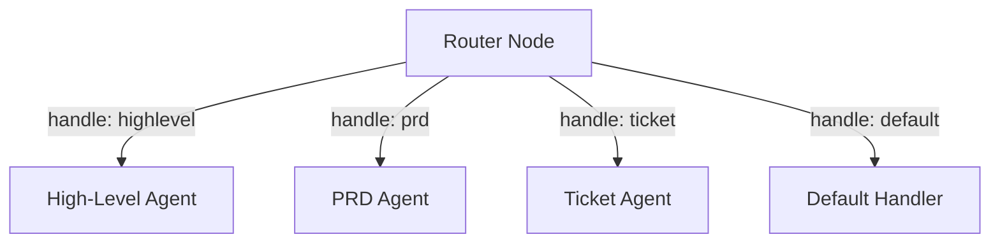
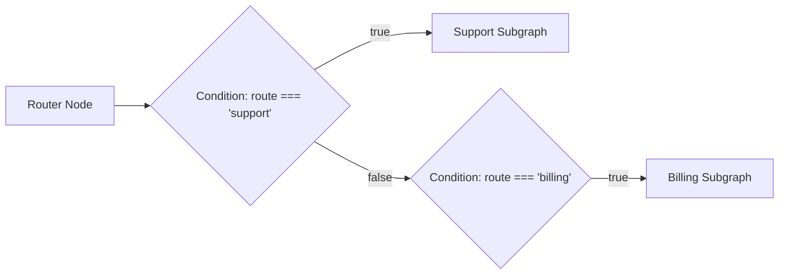

# Router Tool Documentation & Usage Guide

The **Router** node evaluates an incoming value against a declarative list of route matching rules and resolves the appropriate target destination route. It provides clean multi-way routing and intent-based switching for chat bots, ticket categorization, and state-machine flows without creating complex nested condition trees.

---

## Table of Contents
1. [Overview & Architecture](#1-overview--architecture)
2. [Node Inputs & Configuration](#2-node-inputs--configuration)
3. [Route Definition & Matching Rules](#3-route-definition--matching-rules)
   - [Exact Value Matching](#exact-value-matching)
   - [Array Membership Matching](#array-membership-matching)
   - [Default Fallback Route](#default-fallback-route)
4. [Outputs & Schema](#4-outputs--schema)
5. [Downstream Switching Patterns](#5-downstream-switching-patterns)
6. [Real-World Recipes](#6-real-world-recipes)
7. [Best Practices](#7-best-practices)

---

## 1. Overview & Architecture

When handling multiple distinct outcomes (e.g. classifying user intent into `"billing"`, `"support"`, `"sales"`, or `"general"`), using chains of two-way **Condition** nodes quickly leads to unwieldy graphs. The Router node evaluates all candidates in a single declarative step:
- **Declarative Route Table**: Defines routes with matching criteria (`when`) and target names.
- **Multiple Triggers**: Supports both exact scalar equality and array inclusion lists (`when: ["refund", "billing", "invoice"]`).
- **Safe Fallback**: Guarantees a destination is always chosen using `default: true` or `defaultRoute`.

```mermaid
graph TD
    IncomingVal[Incoming Value / Intent] --> RouterNode[Router Node]
    RouterNode --> Eval{Evaluate Route Rules}
    Eval -- "when: 'billing'" --> RouteBilling[Route: 'billing']
    Eval -- "when: ['tech', 'bug']" --> RouteTech[Route: 'support']
    Eval -- "when: 'sales'" --> RouteSales[Route: 'sales']
    Eval -- "No match" --> RouteDefault[Route: 'general' (default)]
    RouteBilling --> Result[router.result.route]
    RouteTech --> Result
    RouteSales --> Result
    RouteDefault --> Result
```

---

## 2. Node Inputs & Configuration

| Input Field | Type | Required | Default | Description |
| :--- | :--- | :--- | :--- | :--- |
| `value` | `valueOrVariable` | Yes | `null` | The value to test against route criteria (e.g. `{{agent_1.result.intent}}`). |
| `routes` | `json` | Yes | `[]` | Array of route rule objects. |
| `defaultRoute` | `text` | No | `null` | Fallback route name if no route matches. |

---

## 3. Route Definition & Matching Rules

Each route in `routes` is configured as a JSON object:
```json
{
  "name": "target-destination-name",
  "when": "expected-value",
  "default": false
}
```

### Exact Value Matching
Matches when `value === route.when`:
```json
{ "name": "billing", "when": "invoice" }
```

### Array Membership Matching
Matches if `value` is present in the `when` array:
```json
{ "name": "support", "when": ["bug", "error", "crash", "incident"] }
```

### Default Fallback Route
Matches when no other specific rule satisfies the incoming value:
```json
{ "name": "general-inquiry", "default": true }
```

---

## 4. Outputs & Schema

The Router node outputs a single `result` object:

### Matched Route Output
```json
{
  "status": "completed",
  "result": {
    "route": "support",
    "matched": true,
    "value": "bug"
  }
}
```

### Fallback Route Output (When Default Triggered)
```json
{
  "status": "completed",
  "result": {
    "route": "general-inquiry",
    "matched": false,
    "value": "unknown_request_type"
  }
}
```

---

## 5. Downstream Switching Patterns

The Router node supports two downstream switching patterns:

### Pattern A: Direct Multi-Port Handles (Recommended)
Each route declared in `routes` automatically generates a dedicated colored branch socket on the bottom of the Router node. You can wire each branch socket directly to its respective destination agent or block. Execution will exclusively follow the matching branch handle.



### Pattern B: Condition-Based Switching
You can also connect a single edge from the Router node and evaluate `router.result.route` downstream using **Condition** nodes:



---

## 6. Real-World Recipes

### Recipe 1: Customer Ticket Intent Routing
Route an incoming support message parsed by an LLM:

```json
{
  "value": "{{nodes.agent_classifier.result.category}}",
  "routes": [
    { "name": "urgent-outage", "when": ["outage", "downtime", "security-alert"] },
    { "name": "billing", "when": ["invoice", "refund", "subscription", "charge"] },
    { "name": "feature-request", "when": "enhancement" },
    { "name": "general", "default": true }
  ],
  "defaultRoute": "general"
}
```

### Recipe 2: HTTP Status Code Router
Map response status codes to recovery steps:

```json
{
  "value": "{{nodes.action_api.result.status}}",
  "routes": [
    { "name": "success", "when": [200, 201, 204] },
    { "name": "unauthorized", "when": [401, 403] },
    { "name": "retryable-error", "when": [429, 500, 502, 503] }
  ],
  "defaultRoute": "unknown-error"
}
```

---

## 7. Best Practices

1. **Always Supply a Default Route**: Guarantee predictability by designating a fallback route so execution never enters an undefined state.
2. **Normalize Input Values**: Convert strings to lowercase in upstream nodes so `route.when: ["bug"]` matches `"Bug"` or `"BUG"`.
3. **Use Descriptive Route Names**: Name routes clearly (`"escalate-to-human"`, `"automated-reply"`) for readability in downstream logs and traces.
