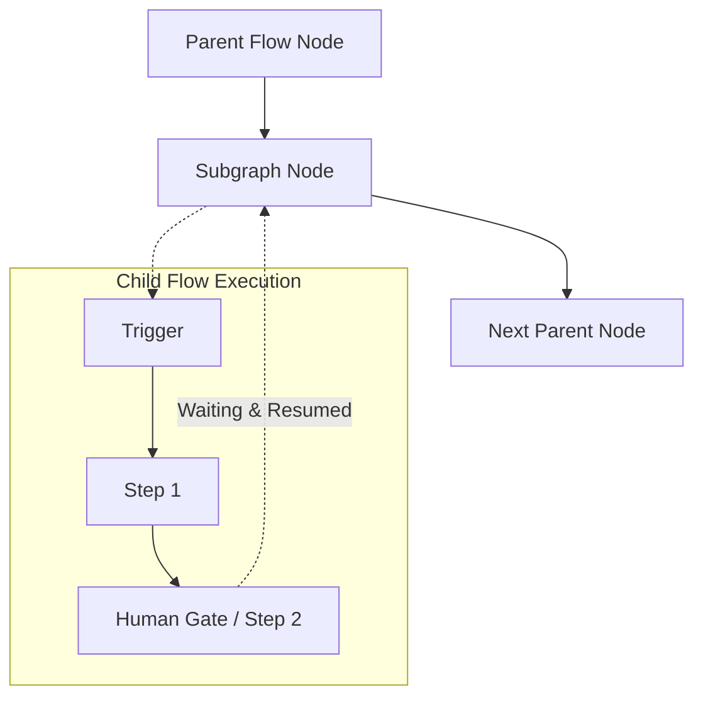

# Subgraph Tool Documentation & Usage Guide

The **Subgraph** node enables modular, reusable workflows by embedding an entire saved graph as a callable sub-flow inside a parent workflow. It supports input mapping, parent-child run tracking, and configurable output modes (**Result** vs. **Full State**).

---

## Table of Contents
1. [Overview & Architecture](#1-overview--architecture)
2. [Node Inputs & Configuration](#2-node-inputs--configuration)
3. [Input Mapping & Passing Parameters](#3-input-mapping--passing-parameters)
4. [Output Modes: Result vs. State](#4-output-modes-result-vs-state)
5. [Outputs & Downstream Referencing](#5-outputs--downstream-referencing)
6. [Real-World Examples & Recipes](#6-real-world-examples--recipes)
7. [Troubleshooting & Best Practices](#7-troubleshooting--best-practices)

---

## 1. Overview & Architecture

When a Subgraph node runs:
- **Child Execution**: The runner initializes a child run linked to the parent run via `parentRunId` and preserves the root workflow identifier via `rootRunId`.
- **Nesting Guard**: Bounded to a maximum nesting depth of **10** (exceeding limits halts with `MAX_SUBGRAPH_DEPTH_EXCEEDED`).
- **Context Isolation**: The child graph executes with its own isolated node scope, receiving initial inputs defined by `input` (or legacy `inputMapping`). Only explicit inputs cross the boundary.
- **Parent-Child Waiting & Recovery**: If a child flow encounters a `human-gate` or wait node, it transitions to `waiting`. The parent run also transitions to `waiting`, recording `waitingChildRunId`. When the parent is resumed via `/runs/:runId/resume`, execution resumes the child flow from its exact checkpoint without restarting from the beginning.
- **Cancellation Cascading**: Cancelling a parent run automatically cascades to cancel any active or waiting child run.
- **Output Aggregation**: Once the child flow finishes, its output or state is captured and returned to the parent graph under the `result` handle.



---

## 2. Node Inputs & Configuration

| Input Field | Type | Required | Default | Description |
| :--- | :--- | :--- | :--- | :--- |
| `graphId` | `select` | Yes | `null` | Target saved graph selected from `/api/graphs`. |
| `input` | `valueOrVariable` (multiline) | No | `null` | Unified payload passed to the sub-flow trigger. Supports JSON mapping or direct upstream variable reference. |
| `outputMode` | `select` | Yes | `"result"` | Return format: `"result"` (last node output) or `"state"` (complete context). |
| `outputType` | `code` (ts) | No | `null` | Zod schema describing the expected output for downstream autocomplete. |

> [!NOTE]
> **Backward Compatibility**: If an existing flow previously used `inputMapping`, the runtime engine still automatically falls back to `inputMapping` if `input` is not specified.

---

## 3. Passing Parameters with Unified Input

The unified `input` field supports two primary usage modes:

### Mode A: Key-Value Field Mapping (Structured JSON)
Provide a JSON object mapping multiple parent variables into specific keys expected by the sub-flow's Trigger schema:
```json
{
  "targetUrl": "{{nodes.browser_1.result.url}}",
  "auditFindings": "{{nodes.agent_qa.result.findings}}",
  "requestedBy": "{{trigger.input.user.email}}"
}
```

### Mode B: Direct Upstream Variable Reference
Switch the input selector to **Variable Reference** to pass an entire upstream object directly:
```json
"{{nodes.browser_1.result}}"
```

---

## 4. Output Modes: Result vs. State

| Mode | Option Value | Description |
| :--- | :--- | :--- |
| **Return Result** | `result` | Returns only the final terminal node's output payload. Ideal for clean, encapsulated pipelines. |
| **Return Full State** | `state` | Returns the entire context dictionary of the child graph, allowing the parent to inspect intermediate steps. |

---

## 5. Outputs & Downstream Referencing

| Output Name | Type | Description |
| :--- | :--- | :--- |
| `result` | `object` | The result or state returned by the completed child graph run. |

### Downstream Referencing Syntax:

```json
{{nodes.subgraph_1.result.summary}}
{{nodes.subgraph_1.result.reportUrl}}
{{nodes.subgraph_1.result.score}}
```

---

## 6. Real-World Examples & Recipes

### Recipe 1: Reusable Website Scraping Sub-Flow
*Embed a standardized authentication and scraping graph using structured key-value mapping in `input`.*

```json
{
  "graphId": "66bc901a8f9b230198765432",
  "input": {
    "loginUrl": "https://example.com/login",
    "dashboardUrl": "https://example.com/admin/dashboard",
    "timeoutMs": 15000
  },
  "outputMode": "result",
  "outputType": "z.object({\n  title: z.string(),\n  kpis: z.array(z.string()),\n  screenshotPath: z.string()\n})"
}
```

### Recipe 2: AI Code Reviewer Sub-Flow
*Delegate repository diff analysis to a reusable code audit graph passing a single upstream variable.*

```json
{
  "graphId": "66bc901a8f9b230198765433",
  "input": "{{trigger.input.pull_request.diff_url}}",
  "outputMode": "result",
  "outputType": "z.object({\n  approved: z.boolean(),\n  comments: z.array(z.string()),\n  score: z.number()\n})"
}
```

---

## 7. Troubleshooting & Best Practices

1. **Circular References**: Do not embed a graph inside itself or create recursive subgraph cycles.
2. **Child Flow Testing**: Always test and verify the child graph independently using its own test runner before connecting it into parent subgraphs.
3. **Traceability**: In the backend runs collection, all child runs record their `parentRunId`, allowing you to trace child runs directly in execution logs.
