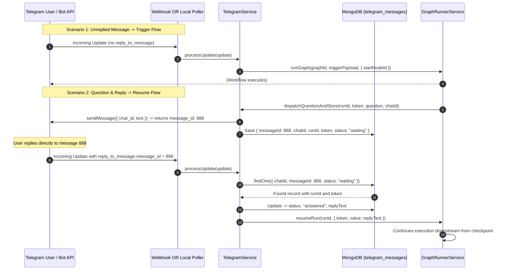

# Telegram Tool Documentation & Usage Guide

The **Telegram** node integrates Telegram messaging into Flow Builder workflows. It connects Telegram chat messages and threads directly with your automated flows, supporting both entrypoint triggers and interactive human-in-the-loop gates.

---

## Table of Contents
1. [Core Capabilities](#1-core-capabilities)
2. [Two Primary Interaction Scenarios](#2-two-primary-interaction-scenarios)
   - [Scenario 1: Trigger (Unreplied Message)](#scenario-1-trigger-unreplied-message)
   - [Scenario 2: Ask Question & Await Reply](#scenario-2-ask-question--await-reply)
3. [Connection Modes: Webhook vs Local Polling](#3-connection-modes-webhook-vs-local-polling)
4. [Node Parameters & Configuration](#4-node-parameters--configuration)
5. [Outputs & Schema](#5-outputs--schema)
6. [Human Gate Telegram Response Channel](#6-human-gate-telegram-response-channel)
7. [Recipes & Examples](#7-recipes--examples)

---

## 1. Core Capabilities

- **Zero-Friction Triggering**: Start flows immediately when a Telegram user sends a new message to your bot.
- **Stateful Question & Reply**: Ask a question, pause the workflow in a durable `waiting` state, send the message to Telegram, and store interaction metadata in MongoDB.
- **Thread & Message ID Tracking**: When a user replies to the bot's question message, the system matches the interaction using Telegram's `reply_to_message.message_id` or `message_thread_id`, retrieves the execution run and resume token, and automatically resumes the flow with the user's answer.
- **Dual Ingestion**:
  - **Webhook Mode**: Telegram posts updates directly to `POST /api/telegram/webhook`.
  - **Local Polling Mode**: For local development without a public domain, the background polling worker fetches updates via `getUpdates` every N seconds.

---

## 2. Two Primary Interaction Scenarios



### Scenario 1: Trigger (Unreplied Message)
- When a user sends a brand-new message to the bot (without replying to an existing prompt), the node functions as a workflow entrypoint.
- Extracts `text`, `chatId`, `userId`, `username`, `threadId`, and `messageId` into downstream variables.

### Scenario 2: Ask Question & Await Reply
- Pauses the workflow in `waiting` status and generates a single-use resume token.
- Dispatches the prompt to Telegram and records `{ messageId, chatId, runId, token, status: "waiting" }` in the `telegram_messages` database collection.
- When the user replies to that specific message in Telegram, the webhook or poller correlates the reply, records the response, and resumes the paused run.

---

## 3. Connection Modes: Webhook vs Local Polling

| Mode | Configuration | How It Works | Best For |
| :--- | :--- | :--- | :--- |
| **Local Polling** | `updateMode: "polling"`, `pollIntervalSeconds: 2` | Backend periodically calls Telegram's `getUpdates` API every N seconds and increments offset. | Local machine development, staging without public domain or ngrok. |
| **Webhook** | `updateMode: "webhook"` | Telegram pushes updates immediately via HTTP `POST /api/telegram/webhook`. | Production deployments with a public HTTPS URL. |

---

## 4. Node Parameters & Configuration

| Field | Type | Required | Default | Description |
| :--- | :--- | :--- | :--- | :--- |
| `mode` | `select` | Yes | `"trigger"` | `"trigger"` (entrypoint), `"question"` (pauses and awaits reply), or `"message"` (outbound one-way). |
| `question` | `textarea` | Yes (for question/message) | `"Please review..."` | Message content or question displayed to the user in Telegram. |
| `chatId` | `valueOrVariable` | Yes (for question/message) | `null` | Target Telegram chat ID or user ID (e.g. `12345678` or `{{nodes.trigger.chatId}}`). |
| `botToken` | `text` | No | `null` | Custom Telegram Bot Token from @BotFather. Defaults to `TELEGRAM_BOT_TOKEN` environment variable. |
| `updateMode` | `select` | No | `"polling"` | `"polling"` (local getUpdates interval) or `"webhook"` (HTTP POST endpoint). |
| `pollIntervalSeconds` | `number` | No | `2` | Polling frequency in seconds (when `updateMode === "polling"`). |
| `timeoutMs` | `number` | No | `86400000` | Max wait time in milliseconds before timing out when awaiting a reply (default: 24h). |

---

## 5. Outputs & Schema

### Trigger Mode Output
```json
{
  "text": "Check status of order #9812",
  "chatId": "78129031",
  "userId": "78129031",
  "username": "faraz",
  "threadId": "42",
  "messageId": 1042
}
```

### Question Resumed State Output
```json
{
  "value": "Approved for release v2.0",
  "text": "Approved for release v2.0",
  "replyText": "Approved for release v2.0",
  "repliedAt": "2026-09-06T21:30:00.000Z",
  "telegramReply": {
    "message_id": 1045,
    "from": { "id": 78129031, "first_name": "Faraz" },
    "text": "Approved for release v2.0"
  }
}
```

---

## 6. Human Gate Telegram Response Channel

The standard **Human Gate** (`human-gate`) node also supports Telegram responses:
- Set `responseType` to `"telegram"`.
- Provide `chatId` (e.g. `{{nodes.trigger.chatId}}`).
- The Human Gate pauses execution, sends the review question to Telegram, stores the interaction in MongoDB, and automatically resumes when the operator replies on Telegram.

---

## 7. Recipes & Examples

### Recipe 1: Telegram Interactive Assistant (Trigger + Reply)
1. **Telegram Node 1 (Mode: `trigger`)**: Listens for user queries.
2. **Agent Node**: Synthesizes a response draft based on user query `{{nodes.telegram_1.text}}`.
3. **Human Gate Node (`responseType: "telegram"`)**:
   - `question`: `"Please review the synthesized draft: {{nodes.agent_1.result}} - Reply to confirm or suggest edits."`
   - `chatId`: `{{nodes.telegram_1.chatId}}`
4. When the user replies in Telegram, the flow resumes with their feedback.
