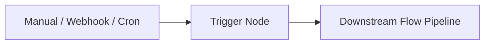

# Trigger Tool Documentation & Usage Guide

The **Trigger** node acts as the entry point of your flow workflow. It defines how execution begins (manual execution, incoming HTTP webhook, or recurring schedule) and specifies a **Zod Input Schema** describing the expected payload shape, providing typed autocomplete variables to all subsequent nodes.

---

## Table of Contents
1. [Overview & Architecture](#1-overview--architecture)
2. [Node Inputs & Configuration](#2-node-inputs--configuration)
3. [Trigger Types & Execution Modes](#3-trigger-types--execution-modes)
   - [Manual Execution](#manual-execution)
   - [Webhook Trigger](#webhook-trigger)
   - [Scheduled Trigger](#scheduled-trigger)
4. [Input Schema Definition (Zod)](#4-input-schema-definition-zod)
5. [Trigger Output & Downstream Referencing](#5-trigger-output--downstream-referencing)
6. [Triggering Workflows via API](#6-triggering-workflows-via-api)
7. [Real-World Examples & Recipes](#7-real-world-examples--recipes)
8. [Troubleshooting & Best Practices](#8-troubleshooting--best-practices)

---

## 1. Overview & Architecture

When a graph is triggered:
- **Root Detection**: The Flow Graph Runner looks for all nodes of type `trigger`. Execution starts at these nodes, passing the initial invocation payload into their output.
- **Variable Propagation**: The payload passed to the run becomes accessible globally as `{{input}}` and under the node's name as `{{nodes.trigger.input}}`.
- **Typing & Autocomplete**: Any properties declared in the `inputSchema` Zod definition are parsed by the frontend and made available in variable pickers across the flow canvas.



---

## 2. Node Inputs & Configuration

| Input Field | Type | Required | Default | Description |
| :--- | :--- | :--- | :--- | :--- |
| `triggerType` | `select` | Yes | `"manual"` | Activation mechanism: `"manual"`, `"event"`, `"webhook"`, or `"schedule"`. |
| `eventTopic` | `combobox` | No | `"artifact.*"` | Event topic pattern to listen for (e.g. `artifact.update`, `artifact.*`, `*.delete`). Supports wildcards. |
| `eventProjectId` | `slug` | No | `""` | Optional project namespace filter. Only triggers if event belongs to this project. |
| `eventEntityId` | `text` | No | `""` | Optional entity ID filter. Supports wildcards (e.g. `prd-*`). |
| `inputSchema` | `code` (ts) | No | `z.object({...})` | Zod schema validating and typing manual/webhook payloads. |

---

## 3. Trigger Types & Execution Modes

### Manual Execution
- **Use Case**: Triggered manually from the Flow Builder UI using the "Run Flow" button or via test runs.
- **Payload**: Can be supplied via the test execution modal in the UI as raw JSON.

### Event Listener Trigger
- **Use Case**: Reactive flows activated automatically whenever a matching domain event (e.g., `artifact.create`, `artifact.update`, `artifact.delete`) is published into the Event Engine.
- **Event Idempotency**: Automatically creates an idempotency key `event.id + graph.id`. Repeated deliveries of the same event to the same graph return the existing run rather than executing duplicates.
- **Propagation Context & Safety Guards**:
  - Automatically receives `sourceEventId`, `sourceEventTopic`, `propagationDepth`, `visitedArtifactLogicalIds`, `rootRunId`, and `propagationRunId`.
  - **Depth Ceiling**: Maximum propagation depth of **5**.
  - **Visited Entity Limit**: Maximum of **100** visited logical IDs.
  - **Cycle Breaker**: Halts execution safely with `status: "partial"` and error code `EVENT_PROPAGATION_LIMIT_REACHED` if a logical ID has already been visited.
- **Payload Preservation**: The complete event envelope (`id`, `topic`, `entityId`, `projectId`, `source`, `data`, `propagationDepth`, `visitedArtifactLogicalIds`) is preserved without dropping metadata. Downstream nodes can bind `{{trigger.entityId}}`, `{{trigger.data.current.content}}`, `{{trigger.data.fileChanges.diff}}`, etc.

### Webhook Trigger
- **Use Case**: Triggered by external web services (e.g. GitHub Webhooks, Stripe events, Slack bots, CRM forms).
- **Payload**: The incoming HTTP request body is passed directly as the initial input payload.

### Scheduled Trigger
- **Use Case**: Time-based or recurring workflows (e.g., daily scraping runs, hourly health checks, nightly reports).
- **Payload**: Often contains runtime metadata such as execution timestamp or target URLs.

---

## 4. Input Schema Definition (Zod)

Defining an input schema gives your entire workflow strong typing. Downstream nodes can safely reference nested fields without guessing property names:

```typescript
z.object({
  targetUrl: z.string().url(),
  query: z.string(),
  maxItems: z.number().default(10),
  notifyEmail: z.string().email().optional(),
  user: z.object({
    id: z.string(),
    role: z.enum(["admin", "user"])
  })
})
```

---

## 5. Trigger Output & Downstream Referencing

The Trigger node produces a single unified output:

| Output Name | Type | Description |
| :--- | :--- | :--- |
| `input` | `object` | The initial JSON payload passed into the flow execution. |

### Downstream Referencing Syntax:

```json
{{input.targetUrl}}
{{input.query}}
{{input.user.id}}
{{nodes.trigger_1.input.maxItems}}
```

---

## 6. Triggering Workflows via API

You can trigger any saved flow programmatically via the backend execution API:

### Endpoint:
`POST /api/runs`

### Request Body:
```json
{
  "graphId": "66b1a2f4c3d8e90123456789",
  "initialInput": {
    "targetUrl": "https://example.com/products",
    "query": "wireless headphones",
    "maxItems": 5,
    "notifyEmail": "team@example.com"
  }
}
```

### Response:
```json
{
  "runId": "c49a64bf-42f2-4545-9ec4-28b9487c6999",
  "graphId": "66b1a2f4c3d8e90123456789",
  "status": "completed",
  "output": { ... },
  "durationMs": 1420
}
```

---

## 7. Real-World Examples & Recipes

### Recipe 1: Web Scraping & QA Pipeline Trigger
```json
{
  "triggerType": "manual",
  "inputSchema": "z.object({\n  url: z.string().url(),\n  auditLevel: z.enum(['basic', 'deep']),\n  slackChannel: z.string().optional()\n})"
}
```

### Recipe 2: GitHub Webhook PR Review Trigger
```json
{
  "triggerType": "webhook",
  "inputSchema": "z.object({\n  action: z.string(),\n  pull_request: z.object({\n    number: z.number(),\n    title: z.string(),\n    html_url: z.string(),\n    diff_url: z.string()\n  }),\n  sender: z.object({\n    login: z.string()\n  })\n})"
}
```

---

## 8. Troubleshooting & Best Practices

1. **Every Graph Needs an Entry Point**: If a graph does not contain a `trigger` node, the runner falls back to finding root nodes (nodes with 0 incoming edges). Having an explicit `trigger` node is recommended for clear entry points.
2. **Schema Optionality**: For optional incoming fields, use `.optional()` in your Zod schema (e.g. `z.string().optional()`) so the runner doesn't reject missing parameters.
3. **Trigger-less Testing**: You can also rerun flows starting from any intermediate node using the runner's `startNodeId` parameter.
