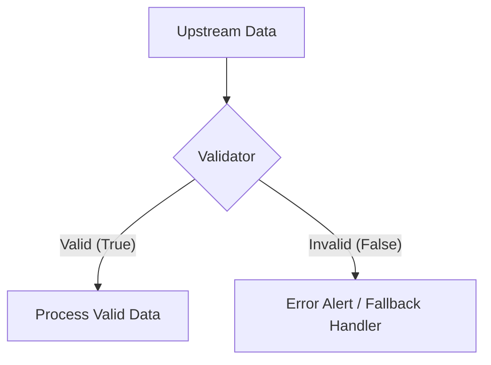

# Validator Tool Documentation & Usage Guide

The **Validator** node verifies that workflow data complies with a required schema, contract, or set of business rules before allowing downstream operations to proceed. It validates data payloads against a **Zod Validation Schema** and routes flow execution along either the **True** (Valid) or **False** (Invalid) branch.

---

## Table of Contents
1. [Overview & Architecture](#1-overview--architecture)
2. [Node Inputs & Configuration](#2-node-inputs--configuration)
3. [Error Handling Strategies (`onError`)](#3-error-handling-strategies-onerror)
4. [Validation Schema Definition (Zod)](#4-validation-schema-definition-zod)
5. [Outputs & Branch Routing](#5-outputs--branch-routing)
6. [Real-World Examples & Recipes](#6-real-world-examples--recipes)
7. [Troubleshooting & Best Practices](#7-troubleshooting--best-practices)

---

## 1. Overview & Architecture

When a Validator node executes:
- **Payload Extraction**: The node retrieves the target variable specified in `input`.
- **Validation Evaluation**: Checks the incoming payload against the configured `schema` rules.
- **Route Execution**: 
  - If valid: Graph execution proceeds down the **True** branch.
  - If invalid: Handles the failure according to `onError` (diverting to the **False** branch, halting the run, or returning an error).



---

## 2. Node Inputs & Configuration

| Input Field | Type | Required | Default | Description |
| :--- | :--- | :--- | :--- | :--- |
| `input` | `variable` | Yes | `null` | Upstream variable payload to validate. |
| `schema` | `code` (ts) | Yes | `z.object({...})` | Zod schema rule validating the incoming payload. |
| `onError` | `select` | Yes | `"branch"` | Action taken if validation fails (`branch`, `stop`, or `returnError`). |

---

## 3. Error Handling Strategies (`onError`)

| Strategy | Value | Behavior | Recommended For |
| :--- | :--- | :--- | :--- |
| **Use Invalid Branch** | `branch` | Routes execution along the `false` output handle without halting the run. | Graceful recovery, retry loops, fallback pipelines, alert notifications. |
| **Stop Flow** | `stop` | Halts execution gracefully at this node. | Non-critical prerequisite checks where further execution should simply cease. |
| **Return Error** | `returnError` | Throws an error, marking the entire flow run as `failed`. | Strict security boundaries, compliance rules, payment checks. |

---

## 4. Validation Schema Definition (Zod)

Use standard Zod schemas to declare required fields, types, string formats, and numerical bounds:

```typescript
z.object({
  id: z.string().uuid(),
  email: z.string().email(),
  age: z.number().min(18),
  roles: z.array(z.string()).nonempty(),
  status: z.enum(["active", "pending"])
})
```

---

## 5. Outputs & Branch Routing

The Validator node exposes two branch output handles:

| Output Handle | Type | Description |
| :--- | :--- | :--- |
| `true` | `branch` | Followed when the input payload successfully passes validation. |
| `false` | `branch` | Followed when the input payload fails validation (when `onError: "branch"`). |

### Output Data Payload:
The node stores the validation result in context:

```json
{
  "valid": true,
  "input": { ... }
}
```

---

## 6. Real-World Examples & Recipes

### Recipe 1: Webhook Payload Guard
*Ensure an incoming webhook contains valid customer email and positive purchase total before placing an order.*

```json
{
  "input": "{{trigger.input}}",
  "onError": "branch",
  "schema": "z.object({\n  customerEmail: z.string().email(),\n  orderTotal: z.number().positive(),\n  items: z.array(z.object({\n    sku: z.string(),\n    quantity: z.number().int().positive()\n  })).nonempty()\n})"
}
```

### Recipe 2: AI Agent Output Quality Check
*Verify an LLM Agent's JSON response contains non-empty findings and a numeric confidence score before proceeding to notification.*

```json
{
  "input": "{{nodes.agent_analyst.result}}",
  "onError": "branch",
  "schema": "z.object({\n  findings: z.array(z.string()).min(1),\n  confidence: z.number().min(0.7),\n  recommendation: z.string().min(10)\n})"
}
```

---

## 7. Troubleshooting & Best Practices

1. **Pairing with Condition Nodes**: While Condition nodes evaluate simple boolean logic or comparisons, Validator nodes are purpose-built for comprehensive structural schema validation with nested types.
2. **Graceful Fallbacks**: When using `onError: "branch"`, connect the `false` handle to an Agent or Script node that logs the discrepancy or sends a Slack alert to your team.
3. **Optional Fields**: Always mark non-mandatory attributes with `.optional()` or `.nullable()` to avoid unnecessary validation errors.
