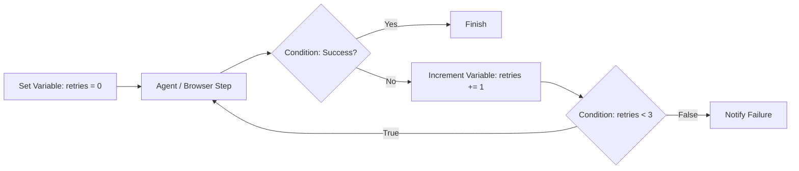

# Variable Management Documentation & Usage Guide

The **Variable** tools—**Set Variable**, **Increment Variable**, and **Decrement Variable**—form the core state management system of the Flow Builder. They enable global flow state persistence, loop counters, state flags, JSON merging, and array accumulation across the graph.

---

## Table of Contents
1. [Overview & Architecture](#1-overview--architecture)
2. [Tool Definitions & Configurations](#2-tool-definitions--configurations)
   - [Set Variable](#set-variable)
   - [Increment Variable](#increment-variable)
   - [Decrement Variable](#decrement-variable)
3. [Supported Data Types & Templating](#3-supported-data-types--templating)
   - [String with Templates](#string-value)
   - [Number Variables](#number-value)
   - [Boolean Flags](#boolean-value)
   - [Deep JSON Interpolation](#json-object--array)
   - [Variable Reference (Pass-by-Reference)](#variable-reference)
4. [Operations (Set, Merge, Append, Delete)](#4-operations-set-merge-append-delete)
5. [In-Place State Mutation & Variable Resolution](#5-in-place-state-mutation--variable-resolution)
6. [Downstream Referencing & Autocomplete](#6-downstream-referencing--autocomplete)
7. [Real-World Recipes & Patterns](#7-real-world-recipes--patterns)
   - [Recipe 1: Loop Counter & Retry Guard with Increment](#recipe-1-loop-counter--retry-guard-with-increment)
   - [Recipe 2: Array Accumulation in Loops (Append Mode)](#recipe-2-array-accumulation-in-loops-append-mode)
   - [Recipe 3: Incremental State Enrichment (Merge Mode)](#recipe-3-incremental-state-enrichment-merge-mode)
   - [Recipe 4: Dynamic JSON Construction with Template Tokens](#recipe-4-dynamic-json-construction-with-template-tokens)
8. [Troubleshooting & Best Practices](#8-troubleshooting--best-practices)

---

## 1. Overview & Architecture

Flow Builder workflows execute across a shared runtime context (`context`). The variable system provides:
* **Global Flow State (`context.state`)**: Any variable created with **Set Variable** is persisted in `context.state[key]` and mirrored into top-level `context[key]`, overwriting existing values if already present.
* **Typed Values**: Variables can be stored as real JavaScript `string`, `number`, `boolean`, `object` (JSON), or `array`.
* **Deep Template Interpolation**: Strings and JSON objects accept mustache variable syntax (e.g. `test_{{node.id}}` or `{{trigger.body.id}}`), recursively resolved before execution.
* **In-Place Mutation**: **Increment Variable** and **Decrement Variable** mutate existing state variables in place so subsequent loop cycles or branch steps read the updated value immediately.

---

## 2. Tool Definitions & Configurations

### Set Variable

Defines, updates, merges, appends to, or deletes a flow state variable.

| Input Field | Type | Required | Default | Condition | Description |
| :--- | :--- | :--- | :--- | :--- | :--- |
| `operation` | `select` | Yes | `set` | Always | Operation mode: `set`, `merge`, `append`, `delete`. |
| `key` | `text` | Yes | `""` | Always | State variable name (e.g. `counter`, `cart`, `user.id`). |
| `valueType` | `select` | Yes | `string` | `operation != 'delete'` | Data type: `string`, `number`, `boolean`, `json`, `variable`. |
| `stringValue` | `text` | No | `""` | `valueType == 'string'` | Text value. Supports variables like `test_{{node.id}}`. |
| `numberValue` | `number` | No | `null` | `valueType == 'number'` | Numeric value (cast to JS `number`). |
| `booleanValue`| `radio` | No | `true` | `valueType == 'boolean'` | Boolean toggle (`true` / `false`). |
| `jsonValue` | `json` | No | `""` | `valueType == 'json'` | JSON object or array with embedded template variables. |
| `variableValue`| `variable` | No | `null` | `valueType == 'variable'` | Direct reference to an upstream node's output. |

#### Output Handles:
* **`value`** (`object`): Returns `{ [key]: finalVal, key, value: finalVal }`.
* **Direct Access**: Accessible as `{{set_variable_1.myKey}}`, `{{set_variable_1.value}}`, or `{{state.myKey}}`.

---

### Increment Variable

Adds a specified numeric amount (default: 1) to an existing numeric variable in state.

| Input Field | Type | Required | Default | Description |
| :--- | :--- | :--- | :--- | :--- |
| `variable` | `variable` | Yes | `null` | Target variable to increment (e.g. `state.counter`, `counter`, or `set_variable_1.counter`). |
| `amount` | `number` | Yes | `1` | Numeric amount to add. |

#### Outputs:
* Emits `{ value: newValue, amount: amount }`.
* Mutates the target variable in `context.state` and `context` in-place.

---

### Decrement Variable

Subtracts a specified numeric amount (default: 1) from an existing numeric variable in state.

| Input Field | Type | Required | Default | Description |
| :--- | :--- | :--- | :--- | :--- |
| `variable` | `variable` | Yes | `null` | Target variable to decrement (e.g. `state.quota`, `quota`, or `set_variable_1.quota`). |
| `amount` | `number` | Yes | `1` | Numeric amount to subtract. |

#### Outputs:
* Emits `{ value: newValue, amount: amount }`.
* Mutates the target variable in `context.state` and `context` in-place.

---

## 3. Supported Data Types & Templating

### String Value
Use for text identifiers, dynamic URLs, or template strings:
```text
test_{{node.id}}
```
Downstream blocks receive a `string` (e.g. `"test_run-9481"`).

### Number Value
Numeric values are parsed directly to real JavaScript numbers:
```text
10
```
This guarantees downstream blocks, math operators, and **Increment / Decrement Variable** perform arithmetic rather than string concatenation (`10 + 1 = 11`, not `"101"`).

### Boolean Value
Radio toggle selecting `true` or `false`. Useful for flow flags such as `is_authenticated`, `has_more_pages`, or `dry_run`.

### JSON (Object / Array)
Write full JSON objects or arrays. Any string field or value inside the JSON can contain `{{...}}` variable tokens:
```json
{
  "session_id": "test_{{node.id}}",
  "user_name": "{{trigger.user.name}}",
  "retry_count": 0,
  "tags": ["automated", "flow"]
}
```
* The runner interpolates the variables first, then runs `JSON.parse()`.
* The state variable is stored as a true queryable JavaScript object (`state.payload.session_id`).

### Variable Reference
Select an upstream node's output from the `VariablePicker` (e.g. `{{shopify_app.result.orders}}`). The entire object or array is assigned directly by reference without stringifying.

---

## 4. Operations (Set, Merge, Append, Delete)

| Operation | Target State | Behavior | Example Use Case |
| :--- | :--- | :--- | :--- |
| **Set / Overwrite** | Any | Assigns the value. If the variable already exists, it is overwritten completely. | Initializing variables, resetting counters. |
| **Merge Object** | JSON Object | Merges properties of the new object into the existing object (`{ ...existing, ...new }`). | Enriching user profiles or metadata step-by-step. |
| **Append to List** | Array / List | Appends the item to the existing array (`[...existing, newItem]`). If not an array, initializes one. | Collecting items or results inside loops. |
| **Delete Variable** | Any | Removes the variable from `context.state` and `context`. | Cleanup, wiping sensitive tokens before ending flow. |

---

## 5. In-Place State Mutation & Variable Resolution

When **Increment Variable** or **Decrement Variable** executes:
1. It resolves the target variable via `context[ref]` or `context.state[key]`.
2. It performs the arithmetic operation (`value + amount` or `value - amount`).
3. It calls `assignReference()`:
   * Updates `context[root]` and `context.state[root]`.
   * Updates dotted paths (e.g. `state.counter`, `order.total`).
   * Synchronizes node aliases (e.g. `set_variable_1.counter`).
4. Any loop edge returning to an upstream node will immediately read the updated value on the next iteration.

---

## 6. Downstream Referencing & Autocomplete

Variables defined in **Set Variable** blocks are automatically registered in the Flow Builder autocomplete system under both their node name and the global state namespace:

| Syntax | Target |
| :--- | :--- |
| `{{state.counter}}` | Global state reference |
| `{{counter}}` | Top-level context reference |
| `{{set_variable_1.counter}}` | Direct node key reference |
| `{{set_variable_1.value}}` | Single output handle reference |

When `valueType` is `number`, the variable picker exposes the item with `type: "number"`. Consequently, **Increment Variable** and **Decrement Variable** (which accept numeric types) will display the variable in their selection dropdown.

---

## 7. Real-World Recipes & Patterns

### Recipe 1: Loop Counter & Retry Guard with Increment

Implement a bounded retry loop that attempts a task up to 3 times:



1. **Set Variable (`init_retries`)**:
   * `operation`: `set`
   * `key`: `retries`
   * `valueType`: `number`
   * `numberValue`: `0`
2. **Execute Task**: Agent or Action block.
3. **Increment Variable (`inc_retries`)**:
   * `variable`: `state.retries`
   * `amount`: `1`
4. **Condition (`check_guard`)**:
   * `leftValue`: `{{state.retries}}`
   * `operator`: `lessThan`
   * `rightValue`: `3`

---

### Recipe 2: Array Accumulation in Loops (Append Mode)

Scrape or process items iteratively and collect them into a single list:

1. **Initialize List (optional)**:
   * `Set Variable`: `key: "scraped_titles"`, `valueType: "json"`, `jsonValue: "[]"`
2. **Inside Loop**:
   * `Set Variable`:
     * `operation`: `append`
     * `key`: `scraped_titles`
     * `valueType`: `string`
     * `stringValue`: `{{browser.result.title}}`
3. **Downstream**:
   * `state.scraped_titles` now contains `["Title 1", "Title 2", "Title 3", ...]`.

---

### Recipe 3: Incremental State Enrichment (Merge Mode)

Build an order summary across multiple steps without overwriting existing data:

1. **Step 1 (Set Base Order)**:
   * `operation`: `set`
   * `key`: `order`
   * `valueType`: `json`
   * `jsonValue`: `{"order_id": "ORD-{{node.id}}", "status": "created"}`
2. **Step 2 (Payment Service Callback)**:
   * `operation`: `merge`
   * `key`: `order`
   * `valueType`: `json`
   * `jsonValue`: `{"payment_status": "paid", "amount": {{stripe.amount}}}`
3. **Resulting State**:
   ```json
   {
     "order_id": "ORD-abc-123",
     "status": "created",
     "payment_status": "paid",
     "amount": 49.99
   }
   ```

---

### Recipe 4: Dynamic JSON Construction with Template Tokens

Construct a structured API payload with embedded variable values:

* **Node**: Set Variable
* **Key**: `api_payload`
* **Operation**: `set`
* **Value Type**: `json`
* **JSON Value**:
  ```json
  {
    "reference": "test_{{node.id}}",
    "query": "{{trigger.body.search_term}}",
    "timestamp": {{timestamp}},
    "metadata": {
      "user_id": "{{input.user_id}}"
    }
  }
  ```
The runner resolves `test_{{node.id}}`, `{{trigger.body.search_term}}`, and `{{input.user_id}}` before creating the object in `state.api_payload`.

---

## 8. Troubleshooting & Best Practices

1. **Always Set Numbers as Numbers**: If you plan to increment or compare a variable numerically, select `valueType: "number"` so it is stored as a JavaScript number, not a string.
2. **Initialize Before Incrementing**: Ensure a **Set Variable** block runs before any **Increment** or **Decrement** node targeting that variable.
3. **Template JSON Syntax**: When embedding variables in JSON strings, wrap template tokens in quotes: `"id": "test_{{node.id}}"`. For numeric expressions, ensure upstream references resolve to valid numbers.
4. **Scope Precedence**: When referencing `{{counter}}`, the resolver checks `context[counter]` and `context.state[counter]`. If multiple nodes set the same key, the most recently executed node's value is active.
