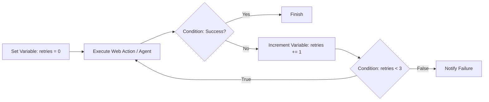

# Variable Management Documentation & Usage Guide

The **Variable** tools—**Set Variable**, **Increment Variable**, and **Decrement Variable**—manage state, counters, flags, and data accumulation across your workflow graph. They enable state persistence, loop counters, retry mechanics, and in-place variable mutation.

---

## Table of Contents
1. [Overview & Architecture](#1-overview--architecture)
2. [Tool Definitions & Configurations](#2-tool-definitions--configurations)
   - [Set Variable](#set-variable)
   - [Increment Variable](#increment-variable)
   - [Decrement Variable](#decrement-variable)
3. [In-Place State Mutation](#3-in-place-state-mutation)
4. [Outputs & Downstream Referencing](#4-outputs--downstream-referencing)
5. [Real-World Patterns & Recipes](#5-real-world-patterns--recipes)
   - [Loop Counter & Termination](#recipe-1-loop-counter--retry-backoff)
   - [Workflow State Flagging](#recipe-2-workflow-state-flagging)
   - [Pagination Offset Increment](#recipe-3-pagination-offset-increment)
6. [Troubleshooting & Best Practices](#6-troubleshooting--best-practices)

---

## 1. Overview & Architecture

Flow Builder workflows execute across a shared runtime context:
- **Set Variable**: Stores a named key and value in the workflow state and emits an object.
- **Increment Variable & Decrement Variable**: Read an existing numeric variable from context, compute the new value by adding or subtracting an amount, and **mutate the reference in-place in the runtime context** so subsequent loop iterations read the updated value.

---

## 2. Tool Definitions & Configurations

### Set Variable
Sets or overwrites a named variable in workflow context.

| Input Field | Type | Required | Default | Description |
| :--- | :--- | :--- | :--- | :--- |
| `key` | `text` | Yes | `""` | Variable identifier (e.g., `retryCount`, `status`, `targetPage`). |
| `value` | `text` | Yes | `""` | Initial or new value. Supports dynamic expressions like `{{trigger.input.id}}`. |

#### Output Handle:
- **`value`** (`object`): Returns `{ [key]: resolvedVal, value: { [key]: resolvedVal } }`.

---

### Increment Variable
Adds a specified amount (default: 1) to an existing numeric variable.

| Input Field | Type | Required | Default | Description |
| :--- | :--- | :--- | :--- | :--- |
| `variable` | `variable` | Yes | `null` | Upstream numeric variable reference (e.g., `{{variables.retryCount}}`). |
| `amount` | `number` | Yes | `1` | Numeric amount to add. |

#### Execution Behavior:
- Automatically mutates the target variable in-place.
- Emits `{ value: newValue, amount: amount }`.

---

### Decrement Variable
Subtracts a specified amount (default: 1) from an existing numeric variable.

| Input Field | Type | Required | Default | Description |
| :--- | :--- | :--- | :--- | :--- |
| `variable` | `variable` | Yes | `null` | Upstream numeric variable reference (e.g., `{{variables.remainingCredits}}`). |
| `amount` | `number` | Yes | `1` | Numeric amount to subtract. |

#### Execution Behavior:
- Automatically mutates the target variable in-place.
- Emits `{ value: newValue, amount: amount }`.

---

## 3. In-Place State Mutation

When an Increment or Decrement node targets a variable reference (such as `variables.counter` or `set_variable_1.counter`):
1. The runner resolves the current numeric value.
2. The arithmetic calculation is performed.
3. The engine **writes back the new value** to that exact reference inside the global context.
4. Downstream nodes or looping edges immediately read the updated value in the next step.

---

## 4. Outputs & Downstream Referencing

### Referencing Set Variable:
```json
{{nodes.set_variable_1.value}}
{{nodes.set_variable_1.status}}
{{variables.status}}
```

### Referencing Increment / Decrement:
```json
{{nodes.increment_variable_1.value}}
{{nodes.decrement_variable_1.value}}
```

---

## 5. Real-World Patterns & Recipes

### Recipe 1: Loop Counter & Retry Backoff
Create a bounded retry loop that attempts an operation up to 3 times before failing:



1. **Set Variable (`init_retry`)**: `key: "retries"`, `value: 0`
2. **Execute Task**: Browser or Agent step.
3. **Condition (`check_status`)**: Check if task succeeded.
4. **Increment Variable (`inc_retry`)**: `variable: "{{variables.retries}}"`, `amount: 1`.
5. **Condition (`check_limit`)**: `leftValue: "{{variables.retries}}"`, `operator: "lessThan"`, `rightValue: 3`.

---

### Recipe 2: Workflow State Flagging
Initialize workflow flags to track user authorization status or processing state:

```json
{
  "name": "Set Variable",
  "key": "isAuthorized",
  "value": "true"
}
```

---

### Recipe 3: Pagination Offset Increment
Iterate through multiple pages by incrementing an offset counter:

```json
{
  "name": "Increment Variable",
  "variable": "{{variables.pageNumber}}",
  "amount": 1
}
```

---

## 6. Troubleshooting & Best Practices

1. **Initialize Before Incrementing**: Always place a **Set Variable** node before your loop or counter sequence to ensure the variable has a defined numeric starting value (e.g. `0`).
2. **Type Safety**: Avoid incrementing non-numeric strings; ensure the value being incremented or decremented is a valid number.
3. **Loop Termination**: Always guard looping variable increments with a **Condition** node to avoid infinite execution cycles.
