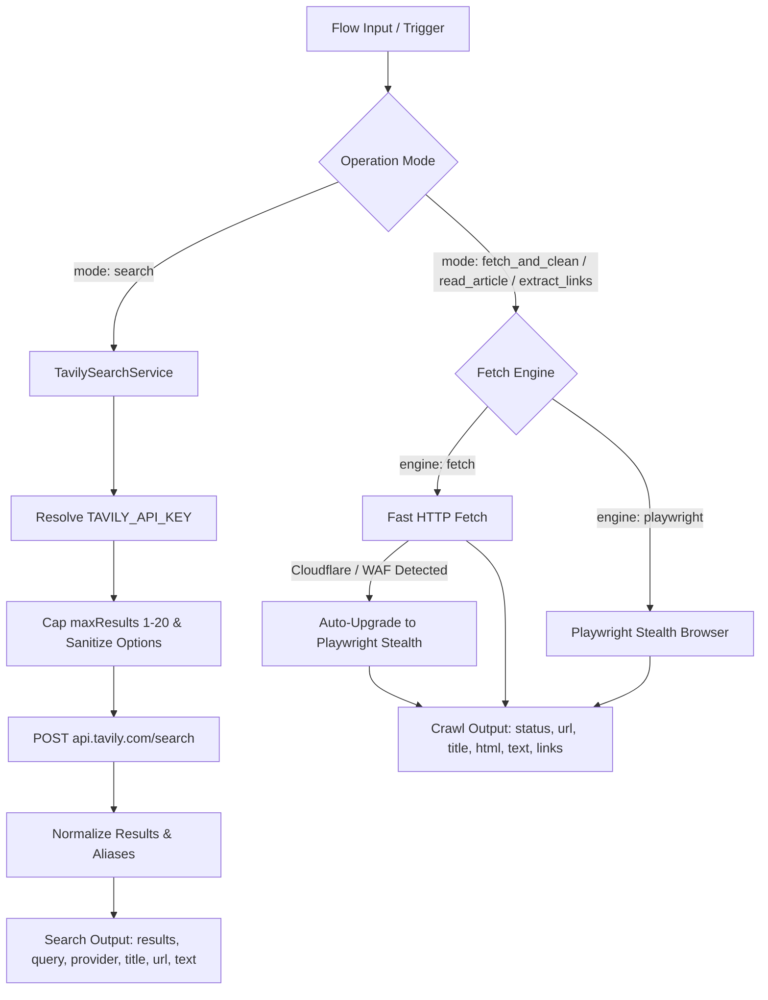

# Web Search Tool Documentation & Usage Guide

The **Web Search** block provides real-time web discovery and content extraction for Flow Builder graphs. It supports two primary modes of operation:
1. **Query-Based Web Search**: Discovers relevant web pages from natural language queries via the [Tavily Search API](https://tavily.com).
2. **URL Crawling & Extraction**: Fetches known web URLs, strips boilerplate and scripts to reduce LLM tokens, reads clean article markdown, and extracts resolved absolute hyperlinks.

---

## Table of Contents
1. [Overview & Architecture](#1-overview--architecture)
2. [Query Search vs. URL Fetching](#2-query-search-vs-url-fetching)
3. [Configuring the Tavily API Key](#3-configuring-the-tavily-api-key)
4. [Node Inputs & Configuration](#4-node-inputs--configuration)
5. [Search Options & Guardrail Ceilings](#5-search-options--guardrail-ceilings)
6. [Outputs & Schema Specifications](#6-outputs--schema-specifications)
7. [Variable Referencing & Downstream Recipes](#7-variable-referencing--downstream-recipes)
8. [Common Errors & Troubleshooting](#8-common-errors--troubleshooting)
9. [Tavily Pricing & Quota Considerations](#9-tavily-pricing--quota-considerations)

---

## 1. Overview & Architecture

Workflows often need to start research without pre-existing URLs. The Web Search block integrates Tavily behind an isolated service boundary (`TavilySearchService`), normalizing search results into a clean, predictable data format that downstream nodes (such as Agents, Loops, Foreach, or Subgraphs) can easily consume.



---

## 2. Query Search vs. URL Fetching

| Feature | Query Search (`mode: "search"`) | URL Crawl (`fetch_and_clean`, `read_article`, `extract_links`) |
| :--- | :--- | :--- |
| **Primary Input** | `query`: Natural language search phrase | `url`: Fully qualified HTTP/HTTPS URL |
| **Underlying Engine**| Tavily Search API | Native HTTP Fetch / Playwright Chromium |
| **Output Type** | Structured array of results with metadata | Full cleaned HTML, markdown text, or link array |
| **Primary Use Case**| Finding relevant sources for questions, topics, news | Ingesting known pages, documentation, or blog articles |
| **Token Savings** | Returns AI-optimized snippets and summary answer | Strips `<script>`, `<style>`, `<nav>`, and `<header>` tags |

---

## 3. Configuring the Tavily API Key

The Web Search tool requires a valid Tavily API key to perform query-based searches.

### Step 1: Obtain a Free Key
1. Sign up at [tavily.com](https://tavily.com).
2. Copy your API key (typically formatted as `tvly-...`).

### Step 2: Configure Server-Side Environment Variable
Set `TAVILY_API_KEY` in your environment or `backend/.env` file:
```bash
TAVILY_API_KEY=tvly-YOUR_ACTUAL_TAVILY_API_KEY
```

Optional settings:
```bash
# Request timeout in milliseconds (default: 20000ms / 20 seconds)
TAVILY_TIMEOUT_MS=20000

# Optional custom API endpoint (defaults to https://api.tavily.com/search)
TAVILY_API_URL=https://api.tavily.com/search
```

> [!IMPORTANT]
> The API key is securely managed server-side. It is never logged in console traces, never returned in node outputs, and never exposed in client requests.

---

## 4. Node Inputs & Configuration

### General Inputs
| Name | Type | Default | Description |
| :--- | :--- | :--- | :--- |
| `mode` | `select` | `"search"` | `search`, `fetch_and_clean`, `extract_links`, `read_article`. |

### Search Mode Inputs (`dependsOn: { field: "mode", equals: "search" }`)
| Name | Type | Required | Default | Description |
| :--- | :--- | :--- | :--- | :--- |
| `query` | `valueOrVariable` | **Yes** | — | Search string or variable reference (e.g. `{{input.topic}}`). |
| `provider` | `select` | No | `"tavily"` | Search engine provider. Currently supports `tavily`. |
| `maxResults` | `number` | No | `5` | Maximum results to return (safe range: 1–20). |
| `searchDepth` | `select` | No | `"basic"` | `"basic"` (fast, 1 credit) or `"advanced"` (in-depth reranking, 2 credits). |
| `topic` | `select` | No | `"general"` | Target category: `"general"`, `"news"`, `"finance"`. |
| `timeRange` | `select` | No | `""` | Publication timeframe: `""` (any), `"day"`, `"week"`, `"month"`, `"year"`. |
| `includeDomains`| `text` | No | — | Comma-separated list of domains to restrict search to (e.g. `github.com, arxiv.org`). |
| `excludeDomains`| `text` | No | — | Comma-separated list of domains to exclude (e.g. `pinterest.com`). |
| `includeAnswer` | `select` | No | `"false"` | If `"true"`, Tavily generates an LLM summary answer based on results. |

### Crawl Mode Inputs (`dependsOn: { field: "mode", notEquals: "search" }`)
| Name | Type | Required | Default | Description |
| :--- | :--- | :--- | :--- | :--- |
| `url` | `valueOrVariable` | **Yes** | — | Fully qualified URL to crawl or extract. |
| `maxContentLength`| `number` | No | `25000` | Maximum character length of extracted text/HTML. |
| `engine` | `select` | No | `"fetch"` | `"fetch"` (fast HTTP) or `"playwright"` (headless Chromium for JS-heavy sites). |

---

## 5. Search Options & Guardrail Ceilings

To protect against token exhaustion, unintended credit consumption, and provider timeouts:
- **Maximum Results Ceilings**:
  - `maxResults` is strictly bounded between **1** and **20**.
  - Values exceeding 20 are automatically capped at 20.
  - Invalid or non-positive values default to 5.
- **Search Depth Considerations**:
  - `basic`: Optimized for speed and low cost (consumes 1 Tavily API credit).
  - `advanced`: Employs reranking algorithms and retrieves richer snippets (consumes 2 Tavily API credits).
- **Domain Cleaning**:
  - Input domains are automatically sanitized to hostname roots (stripping `https://`, URL paths, and whitespace).

---

## 6. Outputs & Schema Specifications

### Search Mode Output Structure

When `mode` is `"search"`, the block returns:

```json
{
  "status": 200,
  "query": "latest advancements in quantum computing",
  "provider": "tavily",
  "resultsCount": 2,
  "results": [
    {
      "title": "Quantum Computing Breakthroughs in 2026",
      "url": "https://example.org/quantum-2026",
      "content": "Researchers have demonstrated fault-tolerant logical qubits with improved coherence times...",
      "score": 0.9842,
      "publishedDate": "2026-03-01T10:00:00Z",
      "favicon": "https://example.org/favicon.ico"
    },
    {
      "title": "Scalable Superconducting Processors",
      "url": "https://example.com/processors",
      "content": "An overview of topological qubit scaling and cryogenic control architectures.",
      "score": 0.9125
    }
  ],
  "title": "Quantum Computing Breakthroughs in 2026",
  "url": "https://example.org/quantum-2026",
  "text": "Researchers have demonstrated fault-tolerant logical qubits...",
  "answer": "Recent breakthroughs focus on fault-tolerant logical qubits and cryogenic control.",
  "responseTime": 0.85,
  "usage": {
    "credits_used": 1
  }
}
```

> [!NOTE]
> Top-level `title`, `url`, and `text` are convenience aliases pointing to the highest-ranked search result (or summary answer). This enables immediate piping into existing blocks without manual array indexing.

### Crawl Mode Output Structure

When `mode` is `"fetch_and_clean"`, `"extract_links"`, or `"read_article"`, the block returns:

```json
{
  "status": 200,
  "url": "https://acme.org/blog/architecture",
  "title": "Engineering Architecture 2026",
  "html": "<main><h1>Architecture 2026</h1><p>Cleaned HTML content...</p></main>",
  "text": "# Architecture 2026\nCleaned markdown text without scripts or styling...",
  "links": [
    { "text": "Documentation", "href": "https://acme.org/docs" },
    { "text": "API Reference", "href": "https://acme.org/api" }
  ],
  "linksCount": 2
}
```

---

## 7. Variable Referencing & Downstream Recipes

### Recipe 1: Passing Discovered URLs to a Downstream Loop / Foreach Block
Connect the search node to a **Foreach** block:
- In Foreach node config:
  ```json
  {
    "items": "{{web_search.results}}",
    "itemKey": "item"
  }
  ```
- Downstream sub-nodes access individual properties:
  - `{{item.url}}`: The webpage link.
  - `{{item.title}}`: The result headline.
  - `{{item.content}}`: Extracted snippet.

### Recipe 2: Using Top Result Directly in an Agent Prompt
- In Agent node prompt:
  ```markdown
  Analyze the following recent news for {{input.company}}:
  Title: {{search.title}}
  URL: {{search.url}}
  Snippet: {{search.text}}
  ```

---

## 8. Common Errors & Troubleshooting

| Status Code | Error Message | Cause & Resolution |
| :--- | :--- | :--- |
| **`400 Bad Request`** | `Tavily API key is missing...` | The `TAVILY_API_KEY` environment variable is not set. Add it to your server `.env` or system environment. |
| **`400 Bad Request`** | `Web Search query mode requires a valid non-empty "query"` | The search query resolved to an empty string. Ensure upstream variable contains text. |
| **`401 Unauthorized`** | `Tavily search rejected request: Invalid or unauthorized API key` | The configured Tavily API key is invalid or inactive. Verify your key on [tavily.com](https://tavily.com). |
| **`429 Too Many Requests`** | `Tavily search rate limit or credit quota exceeded...` | You have reached Tavily's rate limit or monthly credit quota. Check your Tavily dashboard. |
| **`502 Bad Gateway`** | `Tavily search provider is currently unavailable` | Tavily API experienced an outage or network error. Retry when the provider recovers. |
| **`504 Gateway Timeout`**| `Tavily search request timed out after 20000ms` | The search took longer than `TAVILY_TIMEOUT_MS`. You may increase the timeout or reduce `maxResults`. |

---

## 9. Tavily Pricing & Quota Considerations

- **Free Allowance**: Tavily's free tier currently provides **1,000 search API credits per month** without requiring a credit card.
- **Credit Consumption**:
  - `basic` search depth: 1 credit per request.
  - `advanced` search depth: 2 credits per request.
- **Plan Terms**: Tavily's pricing, credit allowances, and rate limits are managed by Tavily and subject to change. Please consult [tavily.com/pricing](https://tavily.com) for current terms.

## Provenance fields

Search responses retain the provider's result title, URL, content snippet, score, and publication date when supplied, along with the query and an `accessedAt` timestamp. Fetch/read responses include `originalUrl`, `resolvedUrl`, HTTP `status`, retrieval method, `accessedAt`, and extracted text. `publishedAt` is `null` for a fetched page when no publication metadata is available. A missing page title is returned as an empty value and must not be turned into a citation title without checking the source.
